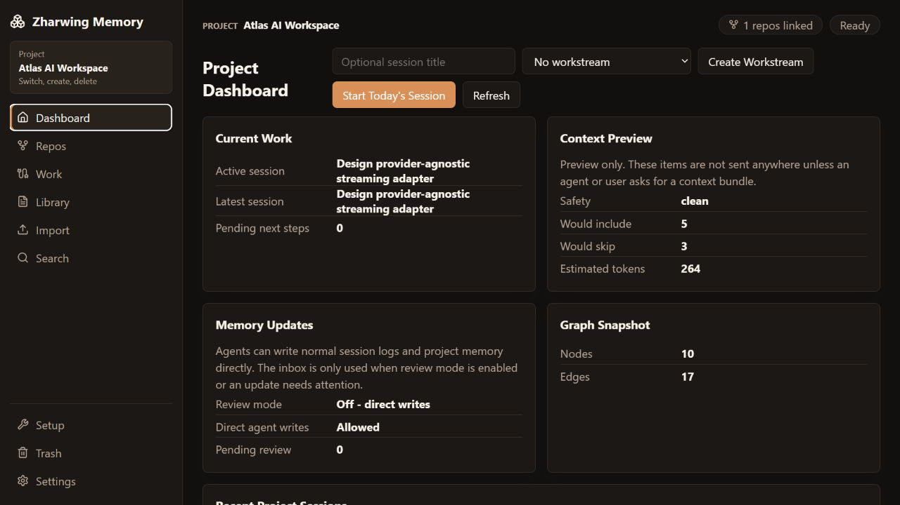

# Zharwing Memory

Zharwing Memory is a local-first project context manager for AI-assisted coding workflows. It is not the coding agent. External agents such as Codex, Claude Code, Gemini CLI, Ollama-based tools, LM Studio workflows, and future MCP-capable clients do the engineering work. Zharwing Memory provides their durable, project-scoped memory layer.

The product keeps project knowledge, AI session history, context bundles, diagrams, decisions, commands, gotchas, and optional review proposals organized per project. A human can open the local browser UI or native desktop app to understand current work, inspect AI context, inspect the graph, search previous work, and enable review workflows only when wanted.

> **Status: local developer preview. Not release-qualified.** The code ships two
> profiles: `personal-preview` for compatibility and `hardened-local` as the
> security target. Both are implemented; neither has been through installer,
> device, or production testing. See
> [Frontend V2 status](docs/FRONTEND_V2_IMPLEMENTATION_STATUS.md), the
> [developer preview boundary](docs/DEVELOPER_PREVIEW.md), and the
> [qualification matrix](docs/qualification/frontend-qualification-matrix.md).

Frontend V2 is an internal refactor, not a breaking release. Operation names and
project data stay compatible; dated adapters and aliases keep existing clients,
bookmarks, and local preview setups working through the migration.



The [documentation website](https://zharwing.barbutsa.com/memory/) and its
[guide portal](https://zharwing.barbutsa.com/memory/docs/) are built from this
repository and pull in no external dependencies. They document the local app;
they are not a hosted copy of it and cannot reach your memory store. Every guide
has its own URL and reads fine with JavaScript turned off. See the
[website maintenance guide](website/memory/README.md) and the
[source-context boundary](docs/SOURCE_CONTEXT.md).

## Current Implementation Status

This repository is the generic, project-neutral Zharwing Memory application source.
Private user memory, project data, and personal workflows belong outside this
repo in each user's chosen memory store.

Implemented:

- TypeScript monorepo layout.
- Local daemon API.
- CLI helper.
- MCP HTTP endpoint and stdio adapter.
- Tauri + React desktop shell.
- Markdown-first storage model.
- Project registry and `.zharwing/memory.json` pointer support.
- Project-scoped sessions and workstreams.
- Context bundle generation with inclusion/exclusion reasons.
- AI-visible project memory with explicit visibility exclusions, never-send rules,
  secret redaction, and high-risk blocking.
- Optional Memory Inbox proposals for review-mode or risky updates.
- Docs, diagrams, graph, search, backup snapshot, and rebuildable index boundaries.
- Optional local Memory Assistant boundary with deterministic jobs and reviewable proposal support.
- Generic Markdown folder importer with preview/commit flow for existing memory and session corpora.
- Flexible named repository links with custom role/category metadata.
- Desktop/web first-run flow for project-only and single-repo setup.
- Recoverable delete flow with global Trash, restore, and permanent purge actions.
- Lightweight desktop navigation with project switcher, primary sections, and section tabs.
- Configurable project graph rules for mapping imported folder layouts to
  topics, services, packages, diagram groups, and code areas without hardcoded
  project names.
- Optional semantic graph analysis for LLM-assisted relationship proposals,
  review/approval, accepted AI-reviewed graph overlays, and local
  OpenAI-compatible providers.

The Codex/MCP daily-memory loop is complete. The supported capabilities map to
the focused MCP surface as follows:

| Capability | Supported MCP tool |
| --- | --- |
| Resolve startup state | `memory.get_startup_state` |
| Read compact previous-work summaries | `memory.get_startup_state`, `memory.get_latest_session`, `memory.get_recent_sessions` |
| Read selected full session history | `memory.get_session_detail` |
| Start today's work record | `memory.start_session` |
| Search decisions, fixes, commands, and notes | `memory.search` |
| Save progress | `memory.save_checkpoint` |
| Record completion and next steps | `memory.close_session` |

Context preview/load and health checks complete the eleven-tool surface. Project
creation, repository linking, imports, graph settings, backups, and destructive
operations are handled in the UI or CLI instead, where a person can review them.

The daemon, CLI, MCP adapter, browser UI, and desktop UI are present in source.
Optional semantic graph analysis is implemented for local OpenAI-compatible
providers. Graph context map, context, session, docs, import, inbox, backup,
and trash workflows do not require an AI provider.

### What has actually been tested

Run locally against the 2026-08-12 working tree: workspace typecheck, 333
automated tests passing with two skipped for Windows symlink safety, the
production web build within its bundle budgets, the secret-canary build,
fixture and source-artifact guards, the accessibility source checks, generated
public docs, and a headless Edge smoke confirming the browser UI reports a
missing daemon accurately instead of showing a loaded page. Six Rust unit tests
and the Tauri compile/package steps passed against an inert sidecar fixture.

Not tested yet: a real packaged application, a signed installer, live AI
providers, screen readers and other assistive devices, and rollback. All of the
above ran on a working tree rather than a tagged commit, so treat it as a good
sign about the code, not as release evidence. See [Testing](docs/TESTING.md).

## Product Principles

1. Project-scoped by default.
   Sessions, docs, graph, search, context, and startup state all resolve to the current project unless the user explicitly asks for all-project behavior.

2. Markdown is the source of truth.
   The index is a versioned JSON cache rebuilt from the Markdown, with no
   database dependency. SQLite/FTS5 is on the table if stores ever get large
   enough to need it.

3. UI, CLI, and MCP share daemon behavior.
   The daemon owns project/session/context logic. Each adapter exposes its
   intended surface without reimplementing the underlying rules; MCP stays
   focused on the daily agent-memory loop.

4. AI-visible by default.
   Memory in the selected project is available to the coding agent by default, including sessions, paths, and routine metadata. Explicit visibility exclusions, never-send patterns, and secret scanning remain safety rails.

5. Memory writes are direct by default.
   External AI agents can write routine session progress and durable project memory directly. Memory Inbox review is an optional project setting for teams that want approval gates or for risky/uncertain updates.

6. Session graph visibility is opt-in.
   Every session remains available in Session History, search, and eligible AI
   context. Routine sessions do not create graph nodes. A user can enable
   **Include in graph** from **Work -> Sessions** when a session is important
   enough to belong in the durable project map; its derived relationships are
   included with it.

## Repository Layout

```text
apps/
  desktop/          Shared React browser UI and Tauri human interface
  daemon/           Localhost JSON-RPC daemon
  cli/              zharwing-memory command-line helper
  mcp-server/       MCP-style stdio adapter

packages/
  core/             Domain types, policies, IDs, defaults
  storage/          Markdown storage, registry, sessions, docs, inbox, backups
  privacy/          Visibility gates, patterns, secret scanning, redaction
  context-engine/   Bundle selection, reasons, token estimates, markdown rendering
  search/           Dependency-free keyword search boundary
  graph/            Derived relationship graph
  semantic-graph/   Optional LLM-assisted relationship analysis and proposals
  assistant-runtime/Optional local assistant boundary
  api-client/       Shared daemon API client
  mcp-tools/        MCP tool definitions and dispatch
  theme/            Graphite + Copper design tokens

docs/
  README.md         Documentation index
  SETUP.md          Source setup, runtime profiles, and first project
  SOURCE_CONTEXT.md Public documentation source and privacy boundary
  decisions/        Architecture decision records
  WEB_UI.md         Local browser startup, auth, usage, and troubleshooting
  ARCHITECTURE.md   System architecture
  DATA_MODEL.md     Entities, storage, and metadata
  API_REFERENCE.md  Daemon, CLI, and MCP surfaces
  MCP_SETUP.md      Codex, Claude, HTTP/stdio, auth, and troubleshooting
  AGENT_AUTOMATION.md MCP, bootstrap, and skill setup for agents
  USER_FLOWS.md     Human and agent workflows
  DESKTOP_UI.md     Desktop navigation and first-run flow
  GRAPH_RULES.md    Graph extraction rules for imported layouts
  SEMANTIC_GRAPH.md Optional LLM-assisted relationship analysis
  DIAGRAMS.md       Mermaid UML, ERD, sequence, state, flow diagrams
  OPERATIONS.md     Setup, runtime, backup, validation notes
  AI_TESTING.md     Manual AI-provider and semantic graph smoke tests

website/
  memory/           Dependency-free public documentation website

templates/
  bootstrap/        Generic AGENTS.md and CLAUDE.md templates for linked repos
  mcp/              Generic Codex and Claude MCP config examples
  skills/           Generic Zharwing Memory session skill template
```

## First Run

Zharwing Memory separates application source code from private memory data.

```text
llm-memory/
  project/   app source code, safe to clone and version
  store/     private local memory data, do not commit
```

Other users should clone only the app source, then choose their own private
store path.

```bash
corepack pnpm install
```

The default local data directory works without configuration. To choose a
different private location, create an untracked `.env` containing only:

```text
ZHARWING_MEMORY_ROOT=<absolute-private-store-path>
```

### Local Browser UI

The browser UI is the full local interface for daily use. It runs the same React
pages and workflows as the native desktop window.

Start the local daemon and browser UI together:

```bash
corepack pnpm dev
```

Open `http://127.0.0.1:5174/`. Normal single-user local use requires no token,
launcher, or authentication setup. If you prefer two terminals, `dev:daemon`
and `dev:web` select the same seamless loopback-only mode.

Browser path fields accept typed or pasted absolute paths because browsers
cannot expose arbitrary local folders. The optional `hardened-local` profile is
for advanced environments and is not part of this normal startup flow.

See the dedicated [Browser UI guide](docs/WEB_UI.md) for the full setup,
browser-versus-desktop comparison, local authentication, and troubleshooting.

### Native Desktop UI

For the native Tauri app, run:

```bash
corepack pnpm dev:desktop
```

The Rust desktop host starts and owns the exact hardened daemon it authorizes,
refuses an unrelated listener, and keeps daemon credentials outside WebView
bytes. A packaged application must use its bundled sidecar or an explicitly
trusted command with the same ownership checks. The native shell adds OS folder
pickers; the core project, session, library, graph, and settings workflows are
shared with the browser UI.

In either UI, create a project, then link repos from Repositories. For
multi-repo products, create the project first and add each Git repo root
afterward.

### Pointer Files

A pointer file is a small `.zharwing/memory.json` file that Zharwing Memory can write into a
linked Git repo. It lets tools opened from that repo detect the matching memory
project automatically.

Example:

```json
{
  "projectId": "my-project",
  "memoryRoot": "<absolute-path-to-private-memory-store>"
}
```

When creating a project with **Project only**, the preview shows
`Pointer file: disabled` because no repo is linked yet. Create the project first,
then open Repositories, link each repo root, and leave pointer files enabled if
you want agents and CLI tools to auto-detect the project from those repos.

To migrate existing Markdown memory, open Import after selecting the project.
Use **Memory Docs** for old MEMORY folders, **Session History** for old SESSIONS
folders, and **Mixed Workspace** when one folder contains both. Preview first;
commit only after the counts and sample rows look right.

After importing, use Graph Rules when the imported folder layout should create
context hubs in the Graph page. Open **Settings -> Project -> Graph Rules** and
save a JSON array such as:

```json
[
  { "match": "apps/*", "nodeType": "package", "topic": "frontend" },
  { "match": "services/*", "nodeType": "service", "topic": "backend" }
]
```

This is project configuration, not application hardcoding. Zharwing Memory matches
rules against imported relative paths and derives context graph nodes from them.
Imported documents participate normally. Imported sessions remain searchable
history and default to **Include in graph** off; enable it per session before
session metadata or its imported path contributes to the graph.
Use Graph for memory relationships; use Diagrams for runtime architecture and
service dependencies. See [Graph Rules](docs/GRAPH_RULES.md) for the full manual
and AI-assisted administration workflow.

For AI-assisted relationship cleanup, use the optional semantic graph workflow.
Graph works without a model and shows trusted saved relationships. AI review
creates Inbox proposals; accepted relationships then appear in Graph. See
[Semantic Graph Analysis](docs/SEMANTIC_GRAPH.md).

LM Studio or another local OpenAI-compatible provider is needed only for
provider checks, model-backed session TLDR generation, and model-backed semantic
graph analysis. It is not required for normal validation, daemon startup,
context preview, or Graph viewing. See
[Testing With AI Providers](docs/AI_TESTING.md).

Never commit the memory store. It contains project sessions, docs, imports,
context bundles, Memory Inbox proposals, and backups.

Deletion is recoverable by default. Projects, linked repo entries, workstreams,
sessions, docs, inbox proposals, and backups move to Trash first. Trash supports
restore, single-item permanent delete, selected permanent delete, and full empty.

## Architecture Summary

```text
Browser UI     \
Desktop UI      \
CLI              -> daemon API -> shared packages -> Markdown source of truth
MCP adapter     /                              \-> rebuildable indexes
```

The daemon owns:

- project detection
- project creation/linking
- session start/resume/list/checkpoint/close
- context bundle preview and generation
- project scope, explicit visibility exclusions, and secret checks
- Memory Inbox proposals
- docs and diagrams
- search
- graph projection
- backup and validation
- trash, restore, and permanent purge
- optional assistant jobs

The browser UI, native desktop app, CLI, and MCP server are adapters.

## Memory Root Shape

The memory root is private per-user state. It can live anywhere on the local
machine and is configured with `ZHARWING_MEMORY_ROOT`.

```text
Zharwing Memory Root/
  global/
    projects.json
    trash/
  projects/
    <project-slug>/
      project.json
      overview.md
      architecture.md
      decisions.md
      tasks.md
      gotchas.md
      commands.md
      glossary.md
      privacy.md
      sessions/
      workstreams/
      docs/
      assets/
      generated/
      inbox/
      semantic-graph/
      audit/
      backups/
```

Repos may contain:

```text
.zharwing/memory.json
```

That pointer file contains project identity, the machine-local memory location,
and compact context-selection limits used during project detection.
Because the memory location is machine-local, `.zharwing/memory.json` is ignored by
this app repo by default. Teams can decide separately whether pointer files in
their own linked repos should be committed or kept local.

## Main Workflow

1. Create or link a project.
2. Read the latest relevant previous session.
3. Start a fresh project-scoped session for the current day or work round.
4. Preview or load the AI context bundle when prior context is useful.
5. External AI performs coding work.
6. AI saves checkpoints after meaningful progress.
7. AI closes the session with next steps.
8. AI writes durable memory directly when review mode is off.
9. Review-mode or risky updates go to the Memory Inbox for accept/edit/reject/deferral.

## Agent Automation

For automatic session behavior in Codex, Claude, or local agents:

1. Start the daemon.
2. Register the MCP adapter with `zharwing-memory mcp install auto`.
3. Link source repos from the UI or CLI.
   For multi-repo projects, keep **Write pointer file** enabled for every repo
   and open a separate Codex workspace for each repo being actively changed.
4. Generate repo bootstrap files from `templates/bootstrap/`.
5. Optionally install `templates/skills/ai-memory-session` as a generic Codex
   skill or translate it into another agent's custom instruction format.

Agents should call `memory.get_startup_state` once per work round, use its
compact carry-forward summaries, start a fresh daily/work-round session, search
memory, request selected session detail or context only when needed, save
checkpoints during work, and close or checkpoint at the end. See
[Agent Automation](docs/AGENT_AUTOMATION.md). See
[Repository Links](docs/REPOSITORIES.md#using-one-memory-project-from-several-codex-workspaces)
for the shared-memory, separate-workspace multi-repo pattern.

For localhost-only personal setups, `ZHARWING_MEMORY_AUTH_MODE=none` lets MCP clients use
`http://127.0.0.1:37841/mcp` without a bearer token. The daemon refuses no-auth
mode on non-loopback hosts.

For MCP setup details, including Codex and Claude config, HTTP vs stdio,
Windows/WSL reachability, desktop installer buttons, and troubleshooting, see
[MCP Setup](docs/MCP_SETUP.md).

## CLI Examples

The CLI assumes the daemon is running.

```text
zharwing-memory init <repo-root> --name "My App" --bootstrap AGENTS.md,CLAUDE.md
zharwing-memory projects
zharwing-memory status --project my-app
zharwing-memory repos --project my-app
zharwing-memory link-repo <repo-root> --project my-app --name "Service API" --role service
zharwing-memory create-workstream "Huddle" --project my-app --topic huddle,realtime
zharwing-memory workstreams --project my-app
zharwing-memory start "Fix settings page save bug" --project my-app --agent codex
zharwing-memory sessions --project my-app
zharwing-memory session session-id --project my-app --section body
zharwing-memory context --project my-app --preview
zharwing-memory checkpoint --project my-app --session session-id "Implemented save flow"
zharwing-memory close --project my-app --session session-id "Save bug fixed"
zharwing-memory inbox --project my-app
zharwing-memory search --project my-app "settings save"
zharwing-memory graph --project my-app
zharwing-memory backup --project my-app
zharwing-memory validate --project my-app
zharwing-memory rebuild-index --project my-app
zharwing-memory import-profiles
zharwing-memory import-folder <source-memory-folder> --project my-app --profile markdown-memory
zharwing-memory import-folder <source-sessions-folder> --project my-app --profile markdown-sessions --commit
```

Assistant proposal examples:

```text
zharwing-memory assistant status --project my-app
zharwing-memory assistant summarize-session --project my-app --session session-id
zharwing-memory assistant generate-session-summary --project my-app --session session-id
zharwing-memory assistant generate-session-summaries --project my-app
zharwing-memory assistant generate-session-summaries --project my-app --all
zharwing-memory assistant return-summary --project my-app
zharwing-memory assistant classify-doc --project my-app --doc doc-id
```

## MCP Tools

The MCP adapter exposes exactly eleven project-scoped tools for the daily
coding-memory loop:

- `memory.health`
- `memory.get_startup_state`
- `memory.get_latest_session`
- `memory.get_recent_sessions`
- `memory.get_session_detail`
- `memory.start_session`
- `memory.search`
- `memory.preview_context_bundle`
- `memory.get_context_bundle`
- `memory.save_checkpoint`
- `memory.close_session`

The daemon API is much broader. Use the desktop UI or CLI for
project administration, repository links, workstreams, document editing,
imports, graph settings, backups, Trash, and other administrative operations.
See [API Reference](docs/API_REFERENCE.md) for both surfaces.

## Browser And Desktop UI

The local browser UI and native desktop app share the same React human
interface. The fastest source workflow is `corepack pnpm dev`, then open
`http://127.0.0.1:5174/`. It starts the loopback daemon and browser UI together;
normal single-user use needs no token or launcher setup.
The sidebar is short:

- project switcher for selecting, creating, and deleting projects
- Dashboard
- Repos
- Work
- Library
- Import
- Search
- Trash
- Settings

Secondary pages live inside section tabs:

- Work: Current Work, Sessions, Workstreams
- Library: Docs, Diagrams, Inbox, Graph, Context
- Settings: Project, Setup, Assistant, Backups

In the native Tauri desktop window, Setup, Repositories, and Import provide
Browse buttons for selecting folders with the OS file picker. The browser UI
provides the same underlying workflows but uses typed or pasted absolute paths
because browsers do not expose arbitrary local folder paths to web apps.

See [Browser UI](docs/WEB_UI.md) for startup and troubleshooting, and
[Browser And Desktop UI](docs/DESKTOP_UI.md) for navigation and first-run flow.

The visual direction follows the Graphite + Copper theme from the product plan.

## Documentation

Start here:

- [Public Documentation Website Source](website/memory/README.md)
- [Developer Preview Boundary](docs/DEVELOPER_PREVIEW.md)
- [Documentation Index](docs/README.md)
- [Architecture](docs/ARCHITECTURE.md)
- [Data Model](docs/DATA_MODEL.md)
- [API Reference](docs/API_REFERENCE.md)
- [User Flows](docs/USER_FLOWS.md)
- [Browser UI](docs/WEB_UI.md)
- [Browser And Desktop UI](docs/DESKTOP_UI.md)
- [Graph Rules](docs/GRAPH_RULES.md)
- [Diagrams](docs/DIAGRAMS.md)
- [Operations](docs/OPERATIONS.md)
- [Testing With AI Providers](docs/AI_TESTING.md)
- [MVP Walkthrough](docs/MVP_WALKTHROUGH.md)

## Implementation Notes

- Install dependencies in the same operating system that will run Vite/build
  commands; shared Windows/WSL checkouts can otherwise keep the wrong native
  Vite/Rollup/esbuild optional package.
- Mermaid diagrams are stored as Markdown and are intended to render in Mermaid-capable viewers.
- The assistant runtime can generate searchable session TLDR metadata through a configured local OpenAI-compatible endpoint, with deterministic fallback. It does not download or run a model.
- The versioned JSON index is a supported rebuildable project manifest. Search
  continues to read Markdown-backed project records; SQLite/FTS5 is optional
  future scaling work.

## License

Apache License 2.0 — see [LICENSE](LICENSE). Security reports: see [SECURITY.md](SECURITY.md).
