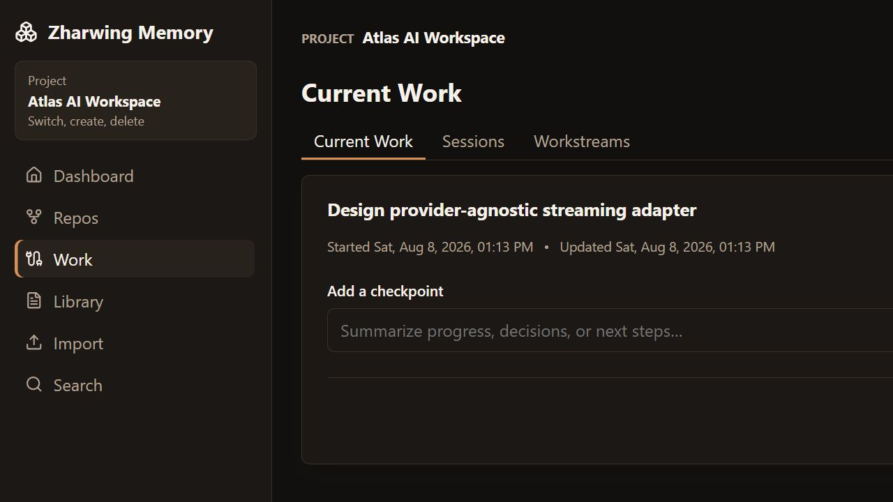

# Developer Preview Boundary

Zharwing Memory is being prepared as a **standalone personal developer
preview**. This preview is useful for developers who want a local, inspectable
memory layer for AI-assisted coding, but it is not a production, multi-user, or
hardened agent-management release.

Preparing this preview does not publish the repository, create a release, or
change any private memory store. Those are separate owner-approved actions.

## Frozen Preview Baseline

- Release branch and upstream: `main` on `origin`
- Source baseline: `fff3de45e6d769774a0a85ca18d6a1c64a322bcd`
- Runtime/filesystem owner: Windows-native
- Node.js: `22.21.0` (the repository also declares the supported Node 24 range)
- pnpm: `9.0.0`
- Canonical execution-plan fingerprint:
  `sha256:f8ef7336ce593e4eba84511d547e460b2f9580a5fcce6ed3ce1b0afb7a11b74c`

The source candidate starts from a clean baseline. Generated output,
dependencies, private stores, credentials, and machine-specific evidence are
not release source.

## Product Profile Decision

The standalone personal preview and the future hardened harness integration
are separate profiles.

The preview preserves the current personal workflow:

- **Authentication:** token authentication remains the default. Explicit
  no-auth mode is limited to a loopback-bound personal daemon.
- **Visibility:** selected-project memory is AI-eligible by default. Explicit
  visibility exclusions, never-send patterns, secret detection, redaction, and
  high-risk blocking remain enforced.
- **Durable writes:** routine agent writes are allowed when project review mode
  is off. Review mode and Memory Inbox proposals remain available when the user
  wants approval or when a change is risky or uncertain.
- **Browser authority:** the browser and desktop UI are the human interface.
  The browser uses the authenticated daemon and does not gain arbitrary
  local filesystem access. Destructive and administrative operations are not
  part of the eleven-tool MCP daily-memory surface.
- **Compatibility:** the current CLI, daemon, browser/desktop UI, pointer-file
  format, Markdown store, and eleven MCP tools remain compatible for this
  preview. Existing stores are not silently migrated to a different policy.
- **Migration and rollback:** the preview performs no profile-policy migration.
  A future hardened profile must be opt-in, versioned, preceded by a verified
  backup, and reversible to the standalone profile without rewriting canonical
  memory content.

The future hardened harness profile must add project-scoped least-privilege
credentials, import-safe visibility, proposal-only durable knowledge changes,
browser session credentials, and explicit migration and rollback behavior. It
must not silently change the standalone preview's behavior.

## Product Screenshots

The screenshots below use a disposable demonstration store and repository.
They contain no private project memory, credentials, or personal paths.




## Preview Limitations

- Intended for a trusted developer operating a local, single-user environment.
- Not qualified for multi-tenant, shared-host, or untrusted-network use.
- Broad end-to-end coverage across every desktop workflow is still incomplete.
- Optional live-provider compatibility requires opt-in testing with each
  provider; normal memory, search, graph, and context workflows do not require
  a model.
- Installer generation and installer-level smoke testing remain outstanding.
  A packaged Windows executable has been built, but it is not being published
  as part of this source preview.
- The hardened harness profile and its security/data-integrity qualification
  remain future work and are not implied by this preview.

## Local Preview Gates

Run the following commands from a clean Windows checkout of the exact candidate
commit using Node.js `22.21.0` and pnpm `9.0.0`:

```powershell
corepack pnpm install --frozen-lockfile
corepack pnpm check:source-artifacts
corepack pnpm typecheck
corepack pnpm test
corepack pnpm build
corepack pnpm test:desktop-browser
cargo test --locked --manifest-path apps/desktop/src-tauri/Cargo.toml
```

The release evidence must record the candidate commit, branch, upstream, OS,
Node and pnpm versions, command, exit code, timestamp, and any intentional skip.
It must also include:

1. `git status --short --branch` before and after validation.
2. A clean-clone or fresh-checkout result using only tracked source and the
   frozen lockfile.
3. A screenshot made only from disposable demonstration data.
4. An independently reviewed diff with no secrets, private memory, generated
   source artifacts, or machine-specific paths.

Installer generation and installer-level smoke testing are explicitly outside
this developer-preview source release and must not be reported as passed.

Remote CI and repository visibility changes happen only after a separate
owner approval. If preview validation fails, keep the repository private,
retain the current installation, and revert only the preview-specific source
and documentation changes.
