# Diagrams

All diagrams are Mermaid source so they remain editable Markdown.

## System Context

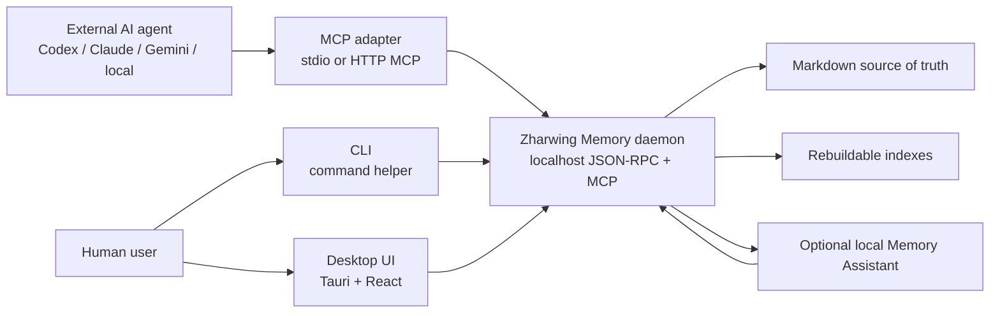
```mermaid
flowchart LR
  User["Human user"]
  Desktop["Desktop UI\nTauri + React"]
  CLI["CLI\ncommand helper"]
  Agent["External AI agent\nCodex / Claude / Gemini / local"]
  MCP["MCP adapter\nstdio or HTTP MCP"]
  Daemon["Zharwing Memory daemon\nlocalhost JSON-RPC + MCP"]
  Storage["Markdown source of truth"]
  Index["Rebuildable indexes"]
  Assistant["Optional local Memory Assistant"]

  User --> Desktop
  User --> CLI
  Agent --> MCP
  MCP --> Daemon
  CLI --> Daemon
  Desktop --> Daemon
  Daemon --> Storage
  Daemon --> Index
  Daemon --> Assistant
  Assistant --> Daemon
```

## Runtime Components

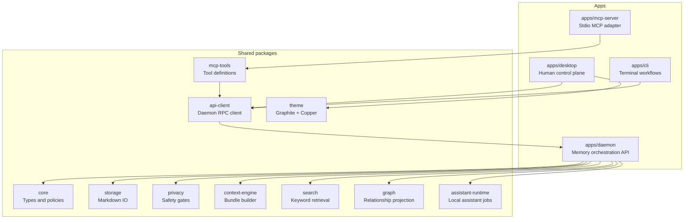
```mermaid
flowchart TB
  subgraph Apps["Apps"]
    Desktop["apps/desktop\nHuman control plane"]
    Daemon["apps/daemon\nMemory orchestration API"]
    CLI["apps/cli\nTerminal workflows"]
    MCPServer["apps/mcp-server\nStdio MCP adapter"]
  end

  subgraph Packages["Shared packages"]
    Core["core\nTypes and policies"]
    Storage["storage\nMarkdown IO"]
    Privacy["privacy\nSafety gates"]
    Context["context-engine\nBundle builder"]
    Search["search\nKeyword retrieval"]
    Graph["graph\nRelationship projection"]
    AssistantRuntime["assistant-runtime\nLocal assistant jobs"]
    ApiClient["api-client\nDaemon RPC client"]
    MCPTools["mcp-tools\nTool definitions"]
    Theme["theme\nGraphite + Copper"]
  end

  Desktop --> ApiClient
  CLI --> ApiClient
  MCPServer --> MCPTools
  MCPTools --> ApiClient
  ApiClient --> Daemon

  Daemon --> Core
  Daemon --> Storage
  Daemon --> Privacy
  Daemon --> Context
  Daemon --> Search
  Daemon --> Graph
  Daemon --> AssistantRuntime
  Desktop --> Theme
```

## Clean Architecture Dependency Direction

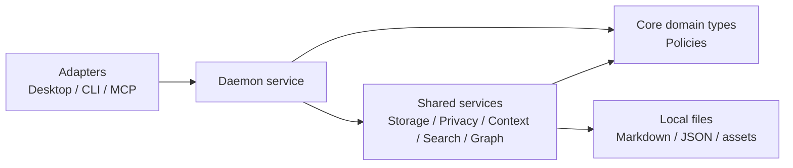
```mermaid
flowchart LR
  Adapters["Adapters\nDesktop / CLI / MCP"]
  Daemon["Daemon service"]
  Domain["Core domain types\nPolicies"]
  Services["Shared services\nStorage / Privacy / Context / Search / Graph"]
  Files["Local files\nMarkdown / JSON / assets"]

  Adapters --> Daemon
  Daemon --> Domain
  Daemon --> Services
  Services --> Domain
  Services --> Files
```

## UML Class Diagram

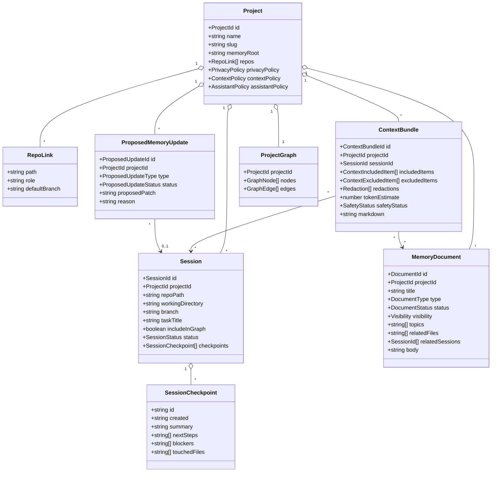
```mermaid
classDiagram
  class Project {
    +ProjectId id
    +string name
    +string slug
    +string memoryRoot
    +RepoLink[] repos
    +PrivacyPolicy privacyPolicy
    +ContextPolicy contextPolicy
    +AssistantPolicy assistantPolicy
  }

  class RepoLink {
    +string path
    +string role
    +string defaultBranch
  }

  class Session {
    +SessionId id
    +ProjectId projectId
    +string repoPath
    +string workingDirectory
    +string branch
    +string taskTitle
    +boolean includeInGraph
    +SessionStatus status
    +SessionCheckpoint[] checkpoints
  }

  class SessionCheckpoint {
    +string id
    +string created
    +string summary
    +string[] nextSteps
    +string[] blockers
    +string[] touchedFiles
  }

  class MemoryDocument {
    +DocumentId id
    +ProjectId projectId
    +string title
    +DocumentType type
    +DocumentStatus status
    +Visibility visibility
    +string[] topics
    +string[] relatedFiles
    +SessionId[] relatedSessions
    +string body
  }

  class ProposedMemoryUpdate {
    +ProposedUpdateId id
    +ProjectId projectId
    +ProposedUpdateType type
    +ProposedUpdateStatus status
    +string proposedPatch
    +string reason
  }

  class ContextBundle {
    +ContextBundleId id
    +ProjectId projectId
    +SessionId sessionId
    +ContextIncludedItem[] includedItems
    +ContextExcludedItem[] excludedItems
    +Redaction[] redactions
    +number tokenEstimate
    +SafetyStatus safetyStatus
    +string markdown
  }

  class ProjectGraph {
    +ProjectId projectId
    +GraphNode[] nodes
    +GraphEdge[] edges
  }

  Project "1" o-- "*" RepoLink
  Project "1" o-- "*" Session
  Session "1" o-- "*" SessionCheckpoint
  Project "1" o-- "*" MemoryDocument
  Project "1" o-- "*" ProposedMemoryUpdate
  Project "1" o-- "*" ContextBundle
  Project "1" o-- "1" ProjectGraph
  ContextBundle "*" --> "*" MemoryDocument
  ContextBundle "*" --> "*" Session
  ProposedMemoryUpdate "*" --> "0..1" Session
```

## Entity Relationship Diagram

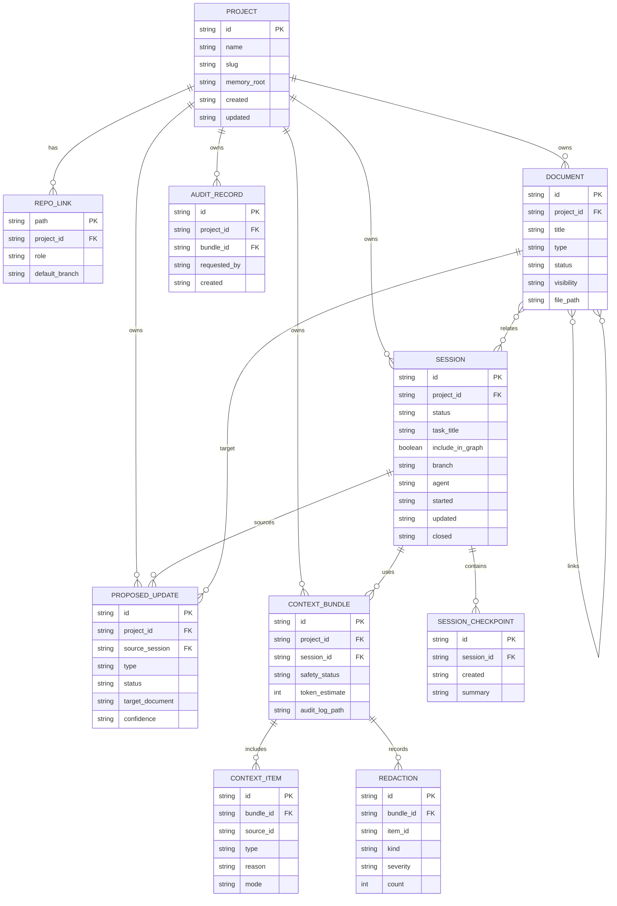
```mermaid
erDiagram
  PROJECT ||--o{ REPO_LINK : has
  PROJECT ||--o{ SESSION : owns
  PROJECT ||--o{ DOCUMENT : owns
  PROJECT ||--o{ PROPOSED_UPDATE : owns
  PROJECT ||--o{ CONTEXT_BUNDLE : owns
  PROJECT ||--o{ AUDIT_RECORD : owns
  SESSION ||--o{ SESSION_CHECKPOINT : contains
  SESSION ||--o{ CONTEXT_BUNDLE : uses
  SESSION ||--o{ PROPOSED_UPDATE : sources
  DOCUMENT ||--o{ PROPOSED_UPDATE : target
  DOCUMENT }o--o{ SESSION : relates
  DOCUMENT }o--o{ DOCUMENT : links
  CONTEXT_BUNDLE ||--o{ CONTEXT_ITEM : includes
  CONTEXT_BUNDLE ||--o{ REDACTION : records

  PROJECT {
    string id PK
    string name
    string slug
    string memory_root
    string created
    string updated
  }

  REPO_LINK {
    string path PK
    string project_id FK
    string role
    string default_branch
  }

  SESSION {
    string id PK
    string project_id FK
    string status
    string task_title
    boolean include_in_graph
    string branch
    string agent
    string started
    string updated
    string closed
  }

  SESSION_CHECKPOINT {
    string id PK
    string session_id FK
    string created
    string summary
  }

  DOCUMENT {
    string id PK
    string project_id FK
    string title
    string type
    string status
    string visibility
    string file_path
  }

  PROPOSED_UPDATE {
    string id PK
    string project_id FK
    string source_session FK
    string type
    string status
    string target_document
    string confidence
  }

  CONTEXT_BUNDLE {
    string id PK
    string project_id FK
    string session_id FK
    string safety_status
    int token_estimate
    string audit_log_path
  }

  CONTEXT_ITEM {
    string id PK
    string bundle_id FK
    string source_id
    string type
    string reason
    string mode
  }

  REDACTION {
    string id PK
    string bundle_id FK
    string item_id
    string kind
    string severity
    int count
  }

  AUDIT_RECORD {
    string id PK
    string project_id FK
    string bundle_id FK
    string requested_by
    string created
  }
```

## Project Startup Sequence

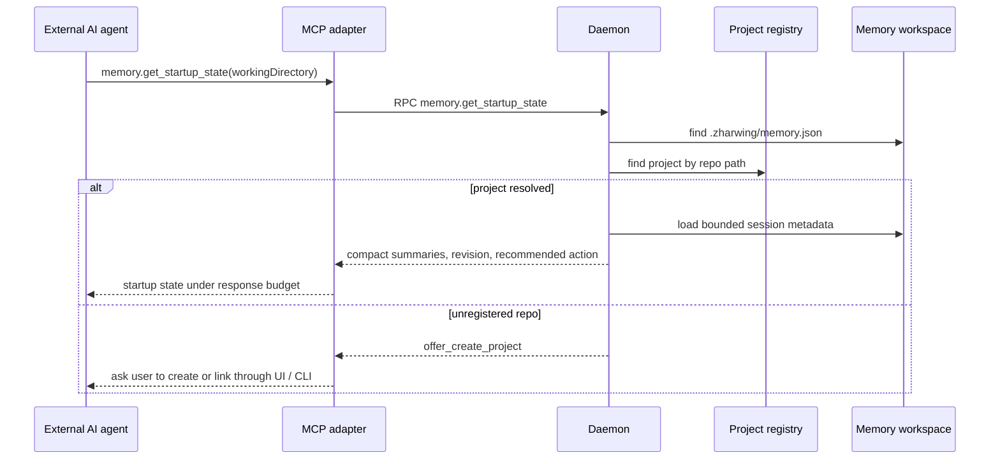
```mermaid
sequenceDiagram
  participant Agent as External AI agent
  participant MCP as MCP adapter
  participant Daemon as Daemon
  participant Registry as Project registry
  participant Storage as Memory workspace

  Agent->>MCP: memory.get_startup_state(workingDirectory)
  MCP->>Daemon: RPC memory.get_startup_state
  Daemon->>Storage: find .zharwing/memory.json
  Daemon->>Registry: find project by repo path
  alt project resolved
    Daemon->>Storage: load bounded session metadata
    Daemon-->>MCP: compact summaries, revision, recommended action
    MCP-->>Agent: startup state under response budget
  else unregistered repo
    Daemon-->>MCP: offer_create_project
    MCP-->>Agent: ask user to create or link through UI / CLI
  end
```

## Project Creation Sequence

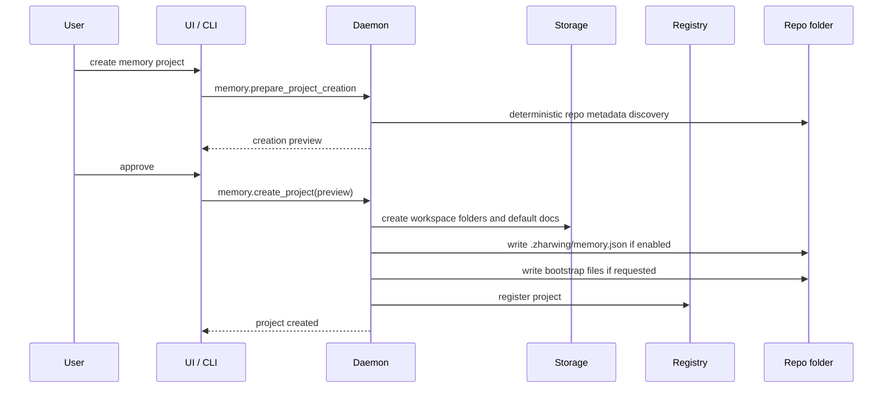
```mermaid
sequenceDiagram
  participant User as User
  participant Client as UI / CLI
  participant Daemon as Daemon
  participant Storage as Storage
  participant Registry as Registry
  participant Repo as Repo folder

  User->>Client: create memory project
  Client->>Daemon: memory.prepare_project_creation
  Daemon->>Repo: deterministic repo metadata discovery
  Daemon-->>Client: creation preview
  User->>Client: approve
  Client->>Daemon: memory.create_project(preview)
  Daemon->>Storage: create workspace folders and default docs
  Daemon->>Repo: write .zharwing/memory.json if enabled
  Daemon->>Repo: write bootstrap files if requested
  Daemon->>Registry: register project
  Daemon-->>Client: project created
```

## Context Bundle Sequence

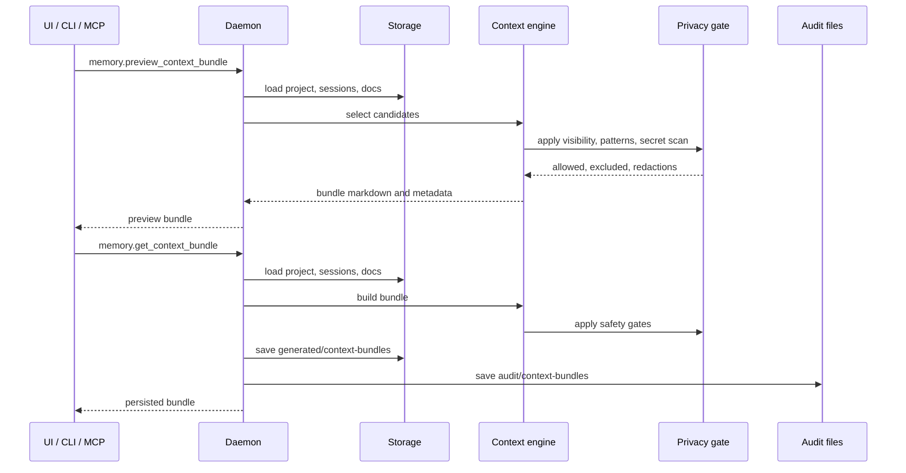
```mermaid
sequenceDiagram
  participant Client as UI / CLI / MCP
  participant Daemon as Daemon
  participant Storage as Storage
  participant Context as Context engine
  participant Privacy as Privacy gate
  participant Audit as Audit files

  Client->>Daemon: memory.preview_context_bundle
  Daemon->>Storage: load project, sessions, docs
  Daemon->>Context: select candidates
  Context->>Privacy: apply visibility, patterns, secret scan
  Privacy-->>Context: allowed, excluded, redactions
  Context-->>Daemon: bundle markdown and metadata
  Daemon-->>Client: preview bundle

  Client->>Daemon: memory.get_context_bundle
  Daemon->>Storage: load project, sessions, docs
  Daemon->>Context: build bundle
  Context->>Privacy: apply safety gates
  Daemon->>Storage: save generated/context-bundles
  Daemon->>Audit: save audit/context-bundles
  Daemon-->>Client: persisted bundle
```

## Checkpoint And Close Session Sequence

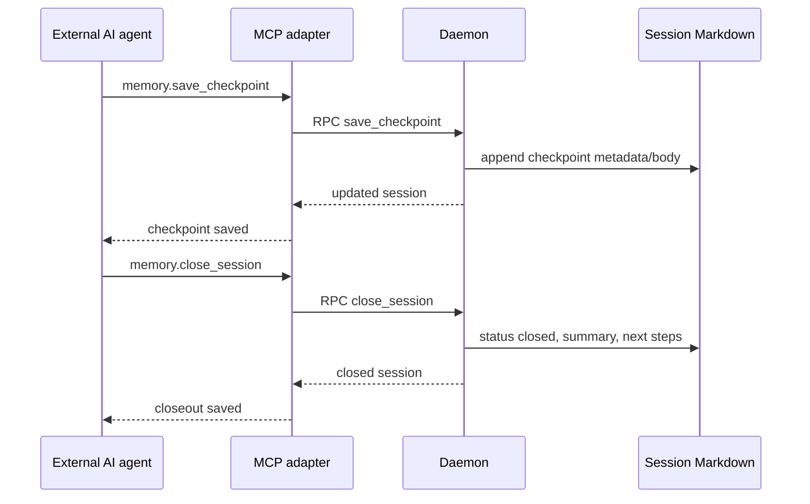
```mermaid
sequenceDiagram
  participant Agent as External AI agent
  participant MCP as MCP adapter
  participant Daemon as Daemon
  participant SessionFile as Session Markdown

  Agent->>MCP: memory.save_checkpoint
  MCP->>Daemon: RPC save_checkpoint
  Daemon->>SessionFile: append checkpoint metadata/body
  Daemon-->>MCP: updated session
  MCP-->>Agent: checkpoint saved

  Agent->>MCP: memory.close_session
  MCP->>Daemon: RPC close_session
  Daemon->>SessionFile: status closed, summary, next steps
  Daemon-->>MCP: closed session
  MCP-->>Agent: closeout saved
```

## Memory Inbox Review Flow

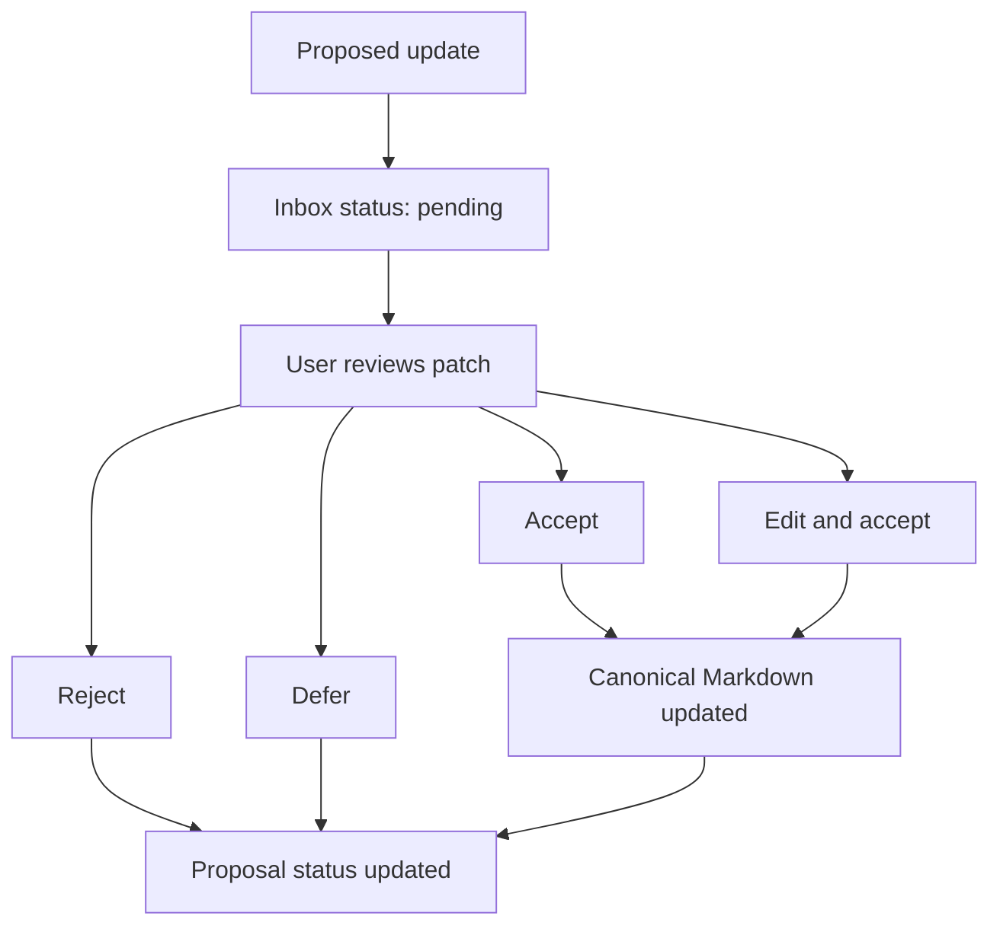
```mermaid
flowchart TD
  Proposal["Proposed update"]
  Pending["Inbox status: pending"]
  Review["User reviews patch"]
  Accept["Accept"]
  Edit["Edit and accept"]
  Reject["Reject"]
  Defer["Defer"]
  Canonical["Canonical Markdown updated"]
  Status["Proposal status updated"]

  Proposal --> Pending
  Pending --> Review
  Review --> Accept
  Review --> Edit
  Review --> Reject
  Review --> Defer
  Accept --> Canonical
  Edit --> Canonical
  Reject --> Status
  Defer --> Status
  Canonical --> Status
```

## Session State Machine

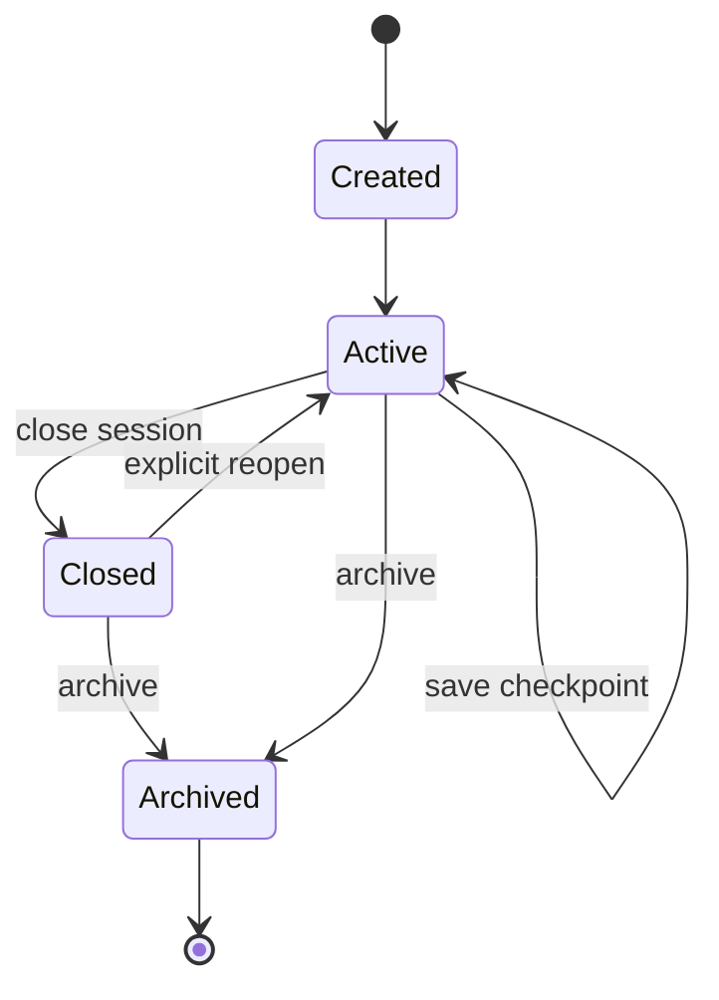
```mermaid
stateDiagram-v2
  [*] --> Created
  Created --> Active
  Active --> Active: save checkpoint
  Active --> Closed: close session
  Closed --> Active: explicit reopen
  Closed --> Archived: archive
  Active --> Archived: archive
  Archived --> [*]
```

## Project Resolution State Machine

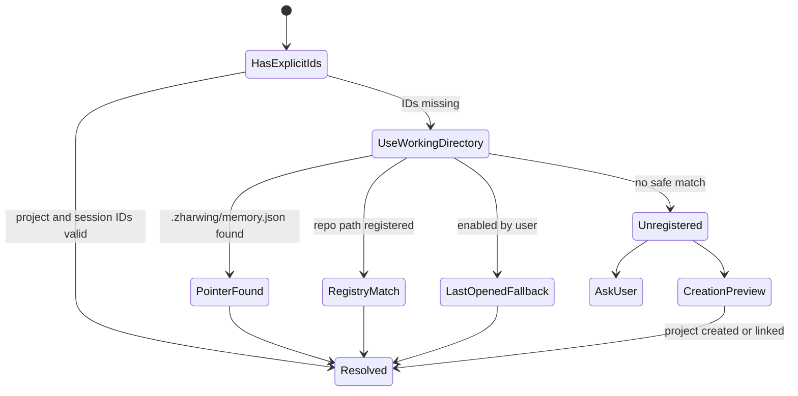
```mermaid
stateDiagram-v2
  [*] --> HasExplicitIds
  HasExplicitIds --> Resolved: project and session IDs valid
  HasExplicitIds --> UseWorkingDirectory: IDs missing
  UseWorkingDirectory --> PointerFound: .zharwing/memory.json found
  PointerFound --> Resolved
  UseWorkingDirectory --> RegistryMatch: repo path registered
  RegistryMatch --> Resolved
  UseWorkingDirectory --> LastOpenedFallback: enabled by user
  LastOpenedFallback --> Resolved
  UseWorkingDirectory --> Unregistered: no safe match
  Unregistered --> CreationPreview
  CreationPreview --> Resolved: project created or linked
  Unregistered --> AskUser
```

## Context Safety State Machine

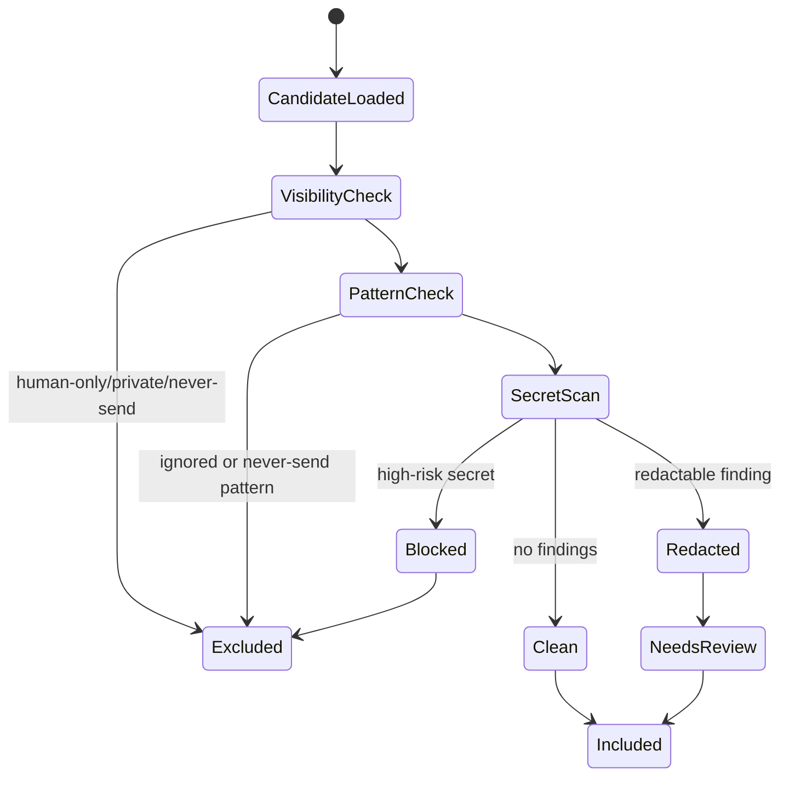
```mermaid
stateDiagram-v2
  [*] --> CandidateLoaded
  CandidateLoaded --> VisibilityCheck
  VisibilityCheck --> Excluded: human-only/private/never-send
  VisibilityCheck --> PatternCheck
  PatternCheck --> Excluded: ignored or never-send pattern
  PatternCheck --> SecretScan
  SecretScan --> Blocked: high-risk secret
  SecretScan --> Redacted: redactable finding
  SecretScan --> Clean: no findings
  Redacted --> NeedsReview
  Clean --> Included
  NeedsReview --> Included
  Blocked --> Excluded
```

## User Flow

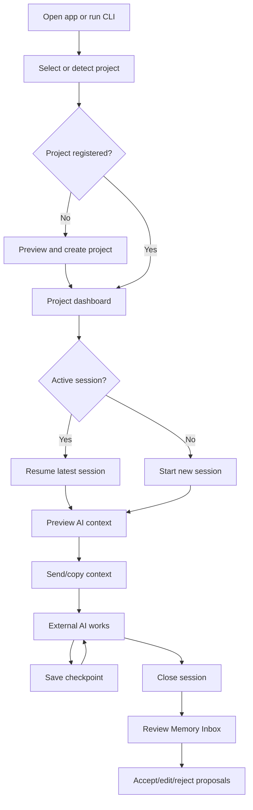
```mermaid
flowchart TD
  Open["Open app or run CLI"]
  SelectProject["Select or detect project"]
  HasProject{"Project registered?"}
  CreateProject["Preview and create project"]
  Dashboard["Project dashboard"]
  HasSession{"Active session?"}
  Resume["Resume latest session"]
  Start["Start new session"]
  Preview["Preview AI context"]
  Send["Send/copy context"]
  Work["External AI works"]
  Checkpoint["Save checkpoint"]
  Close["Close session"]
  Inbox["Review Memory Inbox"]
  Accept["Accept/edit/reject proposals"]

  Open --> SelectProject
  SelectProject --> HasProject
  HasProject -->|No| CreateProject
  CreateProject --> Dashboard
  HasProject -->|Yes| Dashboard
  Dashboard --> HasSession
  HasSession -->|Yes| Resume
  HasSession -->|No| Start
  Resume --> Preview
  Start --> Preview
  Preview --> Send
  Send --> Work
  Work --> Checkpoint
  Checkpoint --> Work
  Work --> Close
  Close --> Inbox
  Inbox --> Accept
```

## Desktop Screen Flow

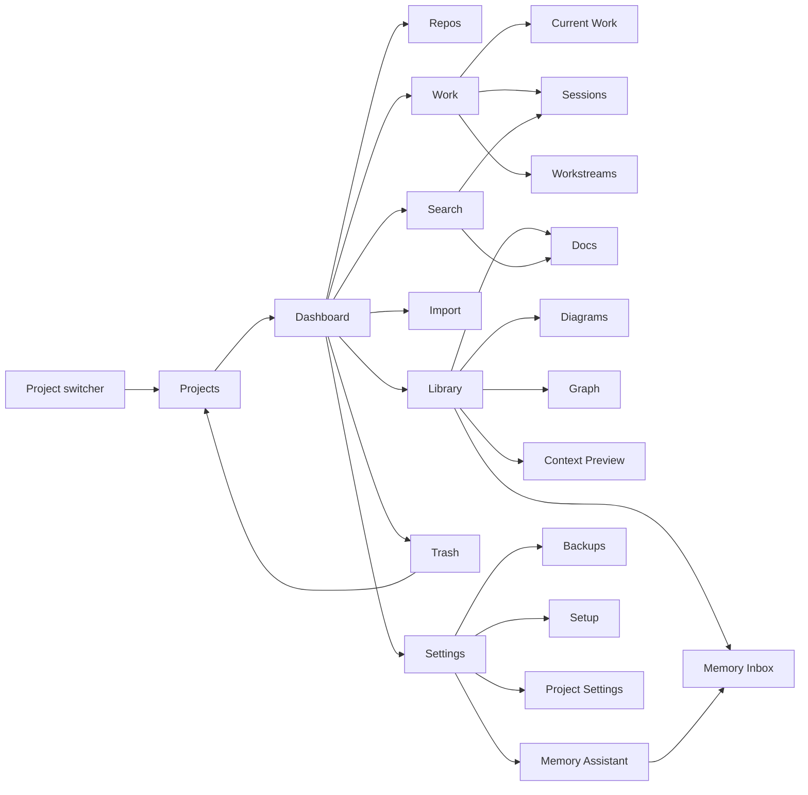
```mermaid
flowchart LR
  Switcher["Project switcher"]
  Dashboard["Dashboard"]
  Repos["Repos"]
  Work["Work"]
  Library["Library"]
  Import["Import"]
  Search["Search"]
  Trash["Trash"]
  Settings["Settings"]

  Projects["Projects"]
  CurrentWork["Current Work"]
  Sessions["Sessions"]
  Workstreams["Workstreams"]
  Docs["Docs"]
  Diagrams["Diagrams"]
  Inbox["Memory Inbox"]
  Graph["Graph"]
  Context["Context Preview"]
  Assistant["Memory Assistant"]
  Backups["Backups"]
  Setup["Setup"]
  ProjectSettings["Project Settings"]

  Switcher --> Projects
  Projects --> Dashboard
  Dashboard --> Repos
  Dashboard --> Work
  Dashboard --> Library
  Dashboard --> Import
  Dashboard --> Search
  Dashboard --> Trash
  Dashboard --> Settings
  Work --> CurrentWork
  Work --> Sessions
  Work --> Workstreams
  Library --> Docs
  Library --> Diagrams
  Library --> Inbox
  Library --> Graph
  Library --> Context
  Settings --> ProjectSettings
  Settings --> Setup
  Settings --> Assistant
  Settings --> Backups
  Search --> Docs
  Search --> Sessions
  Assistant --> Inbox
  Trash --> Projects
```

## Storage Layout

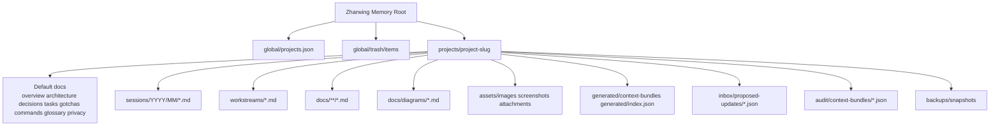
```mermaid
flowchart TB
  Root["Zharwing Memory Root"]
  Global["global/projects.json"]
  Trash["global/trash/items"]
  Project["projects/project-slug"]
  Defaults["Default docs\noverview architecture decisions tasks gotchas commands glossary privacy"]
  Sessions["sessions/YYYY/MM/*.md"]
  Workstreams["workstreams/*.md"]
  Docs["docs/**/*.md"]
  Diagrams["docs/diagrams/*.md"]
  Assets["assets/images screenshots attachments"]
  Generated["generated/context-bundles generated/index.json"]
  Inbox["inbox/proposed-updates/*.json"]
  Audit["audit/context-bundles/*.json"]
  Backups["backups/snapshots"]

  Root --> Global
  Root --> Trash
  Root --> Project
  Project --> Defaults
  Project --> Sessions
  Project --> Workstreams
  Project --> Docs
  Project --> Diagrams
  Project --> Assets
  Project --> Generated
  Project --> Inbox
  Project --> Audit
  Project --> Backups
```

## Graph Projection

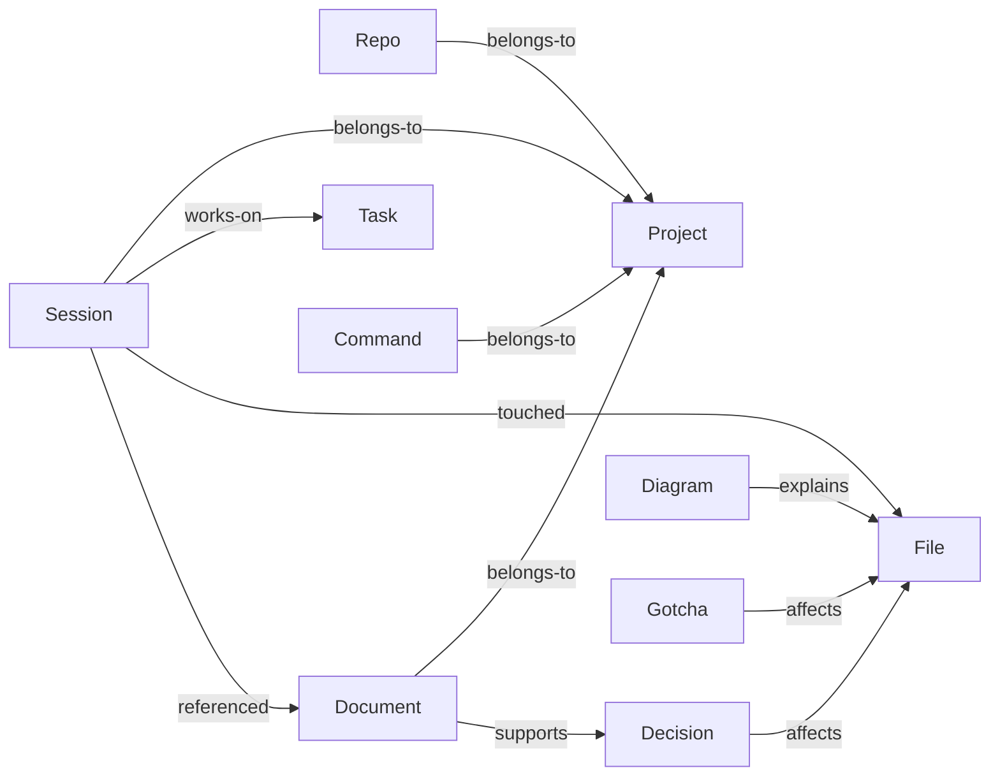
```mermaid
flowchart LR
  Project["Project"]
  Repo["Repo"]
  Task["Task"]
  Session["Session"]
  File["File"]
  Doc["Document"]
  Decision["Decision"]
  Diagram["Diagram"]
  Command["Command"]
  Gotcha["Gotcha"]

  Repo -->|belongs-to| Project
  Session -->|belongs-to| Project
  Doc -->|belongs-to| Project
  Session -->|works-on| Task
  Session -->|touched| File
  Session -->|referenced| Doc
  Doc -->|supports| Decision
  Decision -->|affects| File
  Diagram -->|explains| File
  Command -->|belongs-to| Project
  Gotcha -->|affects| File
```

## Assistant Proposal Flow

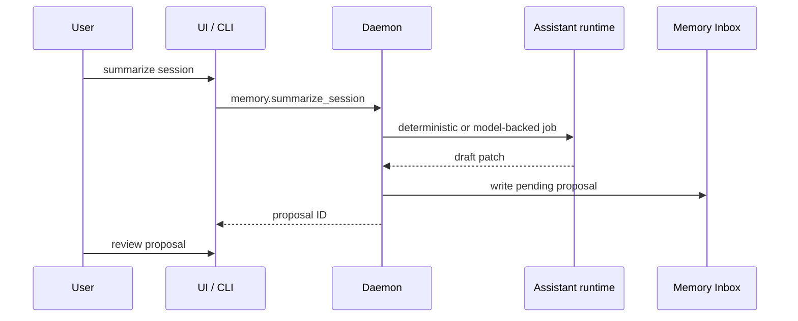
```mermaid
sequenceDiagram
  participant User as User
  participant UI as UI / CLI
  participant Daemon as Daemon
  participant Assistant as Assistant runtime
  participant Inbox as Memory Inbox

  User->>UI: summarize session
  UI->>Daemon: memory.summarize_session
  Daemon->>Assistant: deterministic or model-backed job
  Assistant-->>Daemon: draft patch
  Daemon->>Inbox: write pending proposal
  Daemon-->>UI: proposal ID
  User->>UI: review proposal
```

## Backup And Rebuild Flow

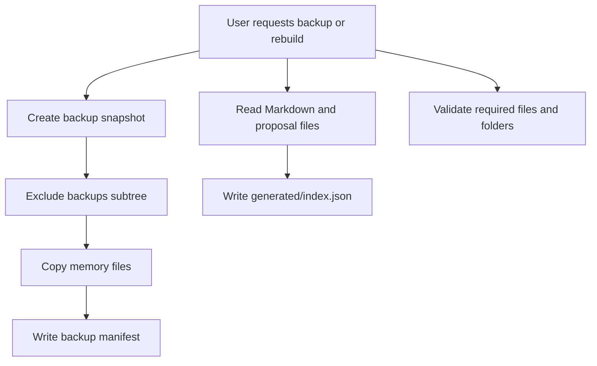
```mermaid
flowchart TD
  Request["User requests backup or rebuild"]
  Snapshot["Create backup snapshot"]
  Exclude["Exclude backups subtree"]
  Copy["Copy memory files"]
  Manifest["Write backup manifest"]
  Rebuild["Read Markdown and proposal files"]
  Index["Write generated/index.json"]
  Validate["Validate required files and folders"]

  Request --> Snapshot
  Snapshot --> Exclude
  Exclude --> Copy
  Copy --> Manifest
  Request --> Rebuild
  Rebuild --> Index
  Request --> Validate
```

## Deployment And Packaging View

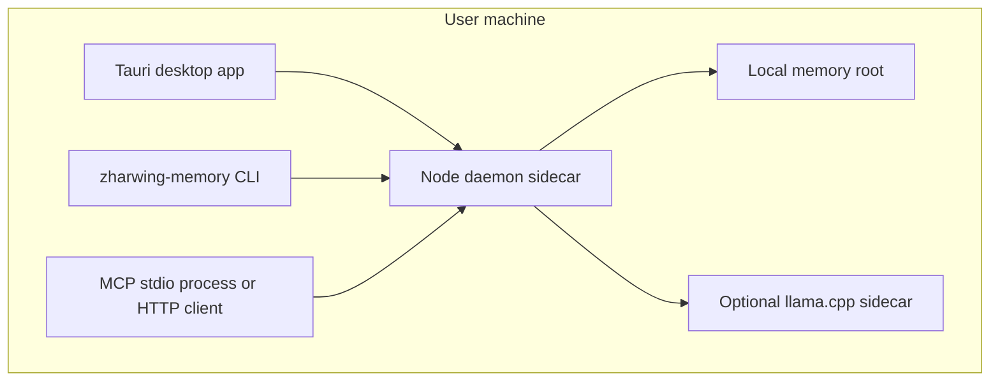
```mermaid
flowchart TB
  subgraph UserMachine["User machine"]
    Desktop["Tauri desktop app"]
    Daemon["Node daemon sidecar"]
    MCP["MCP stdio process or HTTP client"]
    CLI["zharwing-memory CLI"]
    MemoryRoot["Local memory root"]
    LocalModel["Optional llama.cpp sidecar"]
  end

  Desktop --> Daemon
  CLI --> Daemon
  MCP --> Daemon
  Daemon --> MemoryRoot
  Daemon --> LocalModel
```

## Package Dependency Overview

```mermaid
flowchart LR
  Desktop["desktop"] --> ApiClient["api-client"]
  CLI["cli"] --> ApiClient
  MCPServer["mcp-server"] --> MCPTools["mcp-tools"]
  MCPTools --> ApiClient
  ApiClient --> Daemon["daemon"]
  Daemon --> Core["core"]
  Daemon --> Storage["storage"]
  Daemon --> Context["context-engine"]
  Daemon --> Search["search"]
  Daemon --> Graph["graph"]
  Daemon --> AssistantRuntime["assistant-runtime"]
  Storage --> Core
  Context --> Core
  Context --> Privacy["privacy"]
  Privacy --> Core
  Search --> Core
  Graph --> Core
```
