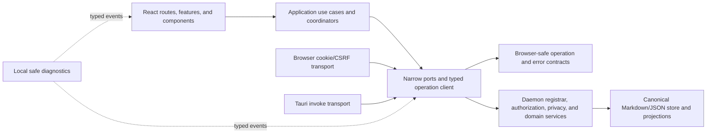

# Zharwing Memory Frontend Implementation Blueprint

**Audience:** the AI implementation agent acting as implementer, reviewer, or orchestrator

**Scope:** the React browser application, Tauri desktop shell, public website and
documentation site, shared frontend contracts, and the minimum daemon changes
required to make those frontends safe

**Status:** repository-owned frontend campaign authority. The matching
`EXECUTION/FRONTEND_WORK_PACKAGES.json` and
`EXECUTION/FRONTEND_IMPLEMENTATION_STATE.json` own package transitions and
evidence. Any copy outside the repository is only a mirror.

**All repository paths in this document are relative to `<repo-root>`.** Never
copy a machine-specific absolute path into source, fixtures, logs, screenshots,
or tests.

---

## 1. Purpose

This document turns the frontend audit into a complete implementation program.
It is intended to let a fresh implementation-agent task understand the product, the
reasoning, the target architecture, the order of work, the evidence required,
and the boundaries that must not be crossed without reconstructing the prior
review.

The goal is not to turn a personal project into an enterprise platform. The
goal is a senior-architect-quality local product that is:

- pleasant and coherent to use;
- safe with multiple local projects and multiple client surfaces;
- explicit about authority, privacy, and destructive effects;
- runtime-safe at every network boundary;
- accessible to keyboard and screen-reader users in its supported envelope;
- responsive and progressively enhanced where those claims are made;
- testable without private data or production-only shortcuts; and
- releasable from evidence tied to the exact source and artifact.

The project already has strong planning and backend foundations. The work is
primarily to make frontend runtime enforcement match those foundations.

---

## 2. Authority and execution rules

Before changing code, read these files in this order:

1. `AGENTS.md`
2. `EXECUTION/AGENT_RULES.md`
3. `EXECUTION/IMPLEMENTATION_PLAN.md`
4. this document
5. `EXECUTION/GENERAL_ORCHESTRATION_PLAN.md`
6. `EXECUTION/FRONTEND_WORK_PACKAGES.json`
7. `EXECUTION/FRONTEND_IMPLEMENTATION_STATE.json`
8. the relevant product and testing documentation

If they conflict, the earlier authoritative source wins. The state ledger is a
record of status/evidence rather than permission to override a plan. This
document owns the subordinate frontend campaign design and ordered
implementation described here. The frontend package index narrows assignment
boundaries. Do not edit either state ledger by hand. This authority never
grants access to private memory, secrets, deployment, destructive external
actions, or unsupported release claims.

The repository orchestrator remains the state authority. For the frontend
campaign, run:

```text
python EXECUTION/orchestrate.py --packages EXECUTION/FRONTEND_WORK_PACKAGES.json --state EXECUTION/FRONTEND_IMPLEMENTATION_STATE.json validate
```

before assigning or starting a package. A null or stale fingerprint is
repairable campaign metadata only before the campaign is sealed: when
validation establishes the canonical plan/package index and no sibling ledger
has an active package, the root orchestrator uses the guarded `baseline`
command to bind the candidate rather than returning the work to the user. Once
any package is accepted or provisionally implemented, plan, package-index, or
base-commit drift requires a governed superseding campaign. Only the
orchestrator performs execution-state transitions.

The slices in section 17 are authoritative packages
`MEM-FE00`-`MEM-FE11`. References to `MEM-P*` packages describe
architectural ancestry or cross-plan traceability only; they are not frontend
assignment gates.

One root Terra task runs the campaign continuously. It keeps exactly one
mutation package active, obtains fresh-context independent review where
required, transitions the package, and immediately selects the next eligible
safe package. Package boundaries, reviewer handoffs, recoverable validation
gaps, and state transitions are internal checkpoints, not reasons to stop the
task. The root still keeps each change bounded and reviewable; it must not
combine an authentication rewrite, store migration, design-system rewrite, and
browser-test rollout into one diff.

One active package is repository-wide across the main and frontend ledgers.
When commits are not authorized, every package uses guarded pre/post
working-tree snapshots, deterministic package-scoped source archives, and a
package-only delta hash. This separates overlapping dirty-tree packages and
keeps their exact pre/post content reviewable without inventing a Git commit.
A runtime without a second agent may mark a self-reviewed package
`implemented` and continue local source work, but that state is provisional
and cannot satisfy acceptance or qualification.

---

## 3. Current product and audit baseline

At the audit snapshot, the repository was clean at commit
`ba5ae3cc17c65594f9815487b8caa00cfc335a48`. Treat that as historical context,
not a current baseline. Re-resolve the branch, commit, worktree, implementation
state, and plan fingerprint at the start of every package.

The product is currently and correctly described as a standalone personal
developer preview for one trusted local user. It is not a hardened multi-client
or production release. The implementation program already contains 28 work
packages; four baseline/repair packages were accepted at the audit snapshot,
while the substantive `MEM-P01` through `MEM-P15` hardening packages remained
pending. Those packages remain the main-plan governance track. This
owner-approved frontend campaign is executed through `MEM-FE00`-
`MEM-FE11`; the older package references below preserve architectural
traceability and do not make a pending `MEM-P*` package a prerequisite
unless the frontend package index explicitly records a frontend dependency.

### 3.1 Material strengths to preserve

- The UI, CLI, MCP server, and desktop shell are adapters to a daemon-owned
  domain boundary.
- React-side network access is centralized in `packages/api-client`.
- The TypeScript monorepo has strict compiler settings and coherent project
  references.
- MobX stores are separated by domain rather than collapsed into one global
  bag.
- The React application uses route-level lazy loading.
- Shared light/dark color values exist in `packages/theme`.
- Markdown rendering constructs React text and restricts link schemes.
- Mermaid is initialized in strict security mode.
- CI uses frozen installs, SHA-pinned actions, least workflow permissions,
  Ubuntu and Windows coverage, CodeQL, Dependabot, source-artifact checks, and
  JavaScript bundle budgets.
- Privacy utilities, default-deny agent method inventory, host/origin checks,
  loopback defaults, request-size limits, and secret canaries already exist.
- The documentation names current limitations instead of claiming unsupported
  readiness.

### 3.2 Material gaps this program closes

1. Project-scoped responses can commit after the selected project changes.
2. The generic RPC client trusts TypeScript assertions instead of runtime
   response codecs.
3. Operations have no common cancellation, timeout, idempotency, correlation,
   compatibility, or typed outcome contract.
4. One ambient bearer can authorize browser, agent, and broad administrative
   access, and `VITE_*` configuration can expose it to emitted frontend code.
5. Privacy enforcement does not dominate every agent-visible entity and read.
6. Tauri has no CSP, holds a broader plugin surface than required, and does not
   keep all durable credentials behind a narrow Rust capability boundary.
7. Permanent destructive confirmations can be disabled with a persistent
   browser preference.
8. Raw daemon messages and stacks can cross the wire and become user-visible
   strings.
9. Loading, not-yet-observed, empty, partial, stale, offline, refused, and failed
   states are conflated.
10. The dialog, selection, form-error, graph, contrast, motion, and forced-color
    accessibility contracts are incomplete.
11. `GraphMap.tsx` and `GraphScreen.tsx` own too many unrelated policies.
12. The public website and documentation hide essential content until
    JavaScript runs, contradicting their progressive-enhancement requirement.
13. Existing browser evidence checks a few DOM strings rather than real user
    journeys.
14. Frontend component tests, production-composed scenarios, accessibility
    checks, packaged-WebView evidence, and exact release evidence are missing.

---

## 4. Product profiles and supported envelope

### 4.1 Compatibility profile: `personal-preview`

This profile preserves existing personal behavior only as an explicit opt-in
compatibility mode:

- one trusted local user;
- loopback only;
- one authoritative daemon/store writer;
- non-sensitive or manually reviewed data;
- no unattended parallel writers;
- clear persistent UI indication that the preview profile is active;
- no claim of hardened browser, agent, or release security.

Do not silently broaden this profile. Do not use it to satisfy hardened-profile
tests.

### 4.2 Target profile: `hardened-local`

This is the implementation target and recommended default after migration:

- still one local human user, not a multi-tenant service;
- separate browser, Tauri, agent, provider, backup, and administrative
  principals;
- project- and audience-bound authority;
- short-lived browser sessions and Rust-held Tauri credentials;
- centralized project/privacy/visibility enforcement;
- retry-safe and revision-aware effects;
- multiple local clients may read safely and cannot corrupt or cross-display
  project data;
- durable knowledge changes are reviewable where policy requires it;
- exact support and release evidence are recorded.

### 4.3 Frontend support floor

| Surface | Supported target |
| --- | --- |
| Packaged desktop | Windows release using the bundled/current supported Tauri WebView2; 980 × 720 minimum window; keyboard-only operation |
| Local browser app | Current and previous Chrome/Edge on Windows; 390, 820, 980, and 1440 CSS-pixel evidence; 200% zoom |
| Public website/docs | Current and previous Chrome, Edge, Firefox, and Safari; 320–1920 CSS pixels; essential content with JavaScript disabled |
| Accessibility | keyboard; visible focus; reduced motion; forced colors; light/dark; one NVDA + Edge complete manual journey per release candidate |
| Touch | emulated 390-pixel journey plus one physical mobile browser pass for the public site |

Anything outside the matrix is unsupported until implementation and evidence
are deliberately added. Browser-preview evidence never substitutes for a
packaged Tauri build.

### 4.4 Language and direction

English and left-to-right layout are the supported product languages for this
program. Full translation is not required. The implementation must still have:

- one locale/direction owner;
- named date, time, relative-time, and number formats;
- safe invalid-value fallbacks;
- long-content and pseudo-RTL fixtures;
- logical CSS properties where direction matters.

This prevents an English-only decision from becoming scattered, untestable
formatting behavior.

---

## 5. Non-goals

Do not implement these unless a later product decision activates them:

- multi-user accounts, organizations, billing, or remote multi-tenancy;
- a hosted browser service that can access a user's private local store;
- a service worker, offline mutation queue, or offline-first replication;
- WebSocket/realtime delivery;
- cross-tab payload synchronization or leader election;
- product analytics, session replay, autocapture, or third-party telemetry;
- full international translation;
- SSR for the private React application;
- a large standalone design-system product;
- a mandatory hosted Storybook;
- framework replacement, Redux/React Query adoption, or CSS-in-JS migration;
- pixel-identical cross-platform rendering;
- formal WCAG certification or exhaustive assistive-technology coverage;
- performance micro-optimization without a named scenario and measurement;
- interfaces around every pure function.

If multiple tabs later become supported, exchange invalidations only and
re-read the daemon. Never broadcast private payloads or executable commands.

---

## 6. Architectural decisions and reasoning

| Decision | Reasoning |
| --- | --- |
| Keep React, MobX, React Router, D3, Vite, CSS, and Tauri | The defects are ownership and boundary defects, not framework defects. Rewrites would add risk without closing them. |
| Add one browser-safe contracts package | Request, response, error, effect, and authorization metadata need one runtime authority usable by daemon and frontend. |
| Use a schema-as-code operation registry | It provides runtime parsing and derived TypeScript types without maintaining a second handwritten interface. Use one deliberately approved runtime schema dependency rather than inventing a broad validator framework. |
| Keep raw transport private | Feature stores must not invent method strings, headers, retries, error parsing, or result casts. |
| One project-scope coordinator | Every scoped store must agree on accepted project identity, generation, cancellation, and commit rules. |
| Retain MobX but replace boolean async state | MobX is adequate; `loading: boolean` is not. Discriminated resource and operation states encode the missing semantics. |
| One transport port with browser and Tauri adapters | The shared React UI can remain shared while browser cookies/CSRF and Rust-held Tauri authority remain materially different. |
| Narrow ports only at effects/volatility boundaries | This gives useful dependency inversion without interface ceremony around pure code. |
| Accessible graph projection beside the SVG | Making every visual edge a tab stop is unusable. A synchronized HTML representation provides complete semantics while preserving the visual graph. |
| Static public website and per-guide documents | Essential documentation must work without JavaScript and be directly addressable. A hidden hash-routed monolith is the wrong rendering strategy. |
| Local, bounded diagnostics; no analytics | Diagnostic evidence is necessary, but product tracking conflicts with the product's privacy posture and has no current product question. |
| Production-composed scenario harness instead of a large design-system site | The project needs real states and fixtures, not a second UI product to maintain. |

### 6.1 Dependency choice for runtime schemas

Adopt one small, maintained schema-as-code dependency in a dedicated contracts
package. The preferred shape is Zod-compatible object schemas because the
repository needs both runtime parsing and inferred TypeScript types. The exact
package and version must be selected through the existing dependency-review
process and frozen in the lockfile. Do not add multiple competing schema
systems.

If the dependency review rejects a new runtime library, generate TypeScript
decoders from the existing JSON-schema authority. Do not fall back to unchecked
`as T` casts or per-store handwritten validation.

---

## 7. Target dependency direction



Rules:

- Components do not import raw transport, filesystem, credential, or daemon
  implementation modules.
- Stores call typed application operations, not string method names.
- Application coordinators may orchestrate multiple domain stores; individual
  stores do not receive the whole root as a service locator.
- Contracts contain data and parsing, not daemon services or browser globals.
- Platform adapters implement ports; they do not acquire domain authority.
- The daemon re-authorizes every operation. A typed frontend is never treated
  as an authorization boundary.

---

## 8. Incremental target file structure

Do not perform a big-bang move. Create the target folders as slices touch the
relevant code, preserve public entry points during migration, and remove a
compatibility path only when its callers and tests are gone.

```text
packages/
  core/
    src/
      contracts/
        entities/
        operations/
        public-errors.ts
        operation-registry.ts
        index.ts
  api-client/
    src/
      client.ts
      transport.ts
      browser-transport.ts
      tauri-transport.ts
      index.ts
  theme/
    src/
      semantic-tokens.ts
      contrast.ts
      index.ts

apps/desktop/src/
  app/
    composition/
    routing/
    recovery/
  application/
    project-scope/
    resources/
    operations/
  components/
    primitives/
    patterns/
  features/
    graph/
      application/
      accessible/
      layout/
      persistence/
      visual/
    ...existing feature slices...
  platform/
    browser/
    tauri/
    diagnostics/
  screens/
  stores/
  styles/
  testing/
    scenarios/
    fixtures/
```

Cross-package APIs use package entry points. Ordinary relative imports inside a
feature are allowed. Do not create catch-all barrels that introduce cycles.

---

## 9. Core runtime contracts

### 9.1 Authoritative operation registry

Create one registry whose entries include at least:

```ts
type EffectClass = "read" | "proposal" | "mutation" | "destructive";
type Audience = "browser" | "desktop" | "agent" | "admin" | "provider" | "backup";

interface OperationDefinition<Input, Output> {
  input: RuntimeSchema<Input>;
  output: RuntimeSchema<Output>;
  effect: EffectClass;
  audiences: readonly Audience[];
  projectScope: "none" | "required";
  privacyProjection: "none" | "human" | "agent" | "provider";
  cancellation: "supported" | "best-effort" | "not-supported";
  idempotency: "not-applicable" | "required";
  timeoutMs: number;
  maximumResponseBytes: number;
  invalidates: readonly ResourceId[];
  compatibilityVersion: number;
  publicErrors: readonly PublicErrorCode[];
}
```

The registry is authoritative for:

- method name;
- complete request and response schemas;
- effect class;
- allowed audiences;
- project-scope requirement;
- privacy/output projection;
- cancellation behavior;
- idempotency requirement;
- timeout and response-size bounds;
- explicit invalidated resources;
- compatibility version;
- closed public outcomes.

Derive the typed client surface and daemon registration from this registry.
Make `call(method: string, params: Record<string, unknown>)` private to the
transport adapter. Add a source/reachability check that fails if production
frontend code imports or calls it directly.

The client must validate:

- HTTP status and content type;
- envelope shape and version;
- response correlation ID;
- success payload schema;
- public error schema;
- empty, malformed, HTML, truncated, and unknown-version responses.

External data is `unknown` until parsed. A TypeScript cast is not parsing.

### 9.2 Composition root and narrow ports

Create one composition root for each frontend runtime. It constructs an
`AppServices` object containing only effect and volatility boundaries:

```ts
interface AppServices {
  memory: MemoryClient;
  clock: Clock;
  ids: IdSource;
  preferences: UiPreferenceStore;
  diagnostics: DiagnosticSink;
  scheduler: Scheduler;
}
```

The browser root selects the cookie/CSRF transport. The Tauri root selects the
invoke transport. Tests supply contract-faithful fakes. `RootStore` accepts
services and domain coordinators; it does not construct a client. Feature stores
receive narrow scope/client/coordinator ports and never the complete root.

Do not introduce a DI container, decorators, reflection, or interfaces around
pure stable functions. Constructor/factory injection is sufficient.

### 9.3 Transport port

```ts
interface OperationContext {
  signal?: AbortSignal;
  timeoutMs: number;
  idempotencyKey?: string;
  expectedRevision?: number;
  correlationId: string;
}

interface MemoryTransport {
  invoke<Name extends OperationName>(
    name: Name,
    input: InputOf<Name>,
    context: OperationContext
  ): Promise<unknown>;
}
```

The typed client owns parsing. A transport owns carrier details only.

Reads may use bounded retry only when explicitly declared safe. Mutations are
never silently retried with a new key. The same idempotency key survives the
entire ambiguity window. A timeout or lost connection after dispatch yields
`outcome-unknown` and authoritative reconciliation, not a confident failure.

### 9.4 Public error algebra

```ts
interface PublicError {
  code: PublicErrorCode;
  messageId: PublicMessageId;
  category: "validation" | "authorization" | "conflict" | "transport" | "internal";
  retry: "never" | "manual" | "after-reconcile";
  fieldErrors?: Record<string, PublicMessageId>;
  debugId?: string;
}
```

The wire response never contains a stack, arbitrary exception message, provider
body, prompt, private path, document content, or credential. Owned message IDs
map to user copy. Diagnostic detail goes to a separate bounded local sink under
a safe-value algebra.

Unknown third-party failures map to an owned generic public error plus a debug
ID. Sanitizing arbitrary text is not permission to show or log it.

### 9.5 Resource and operation state

Use separate state models for observed resources and effects:

```ts
type ResourceState<T> =
  | { status: "idle" }
  | { status: "loading"; scope: ScopeToken }
  | { status: "success"; scope: ScopeToken; data: T; completeness: Completeness }
  | { status: "refreshing"; scope: ScopeToken; data: T; completeness: Completeness }
  | { status: "failure"; scope: ScopeToken; error: PublicError; previous?: T };

type OperationState<Result> =
  | { status: "idle" }
  | { status: "submitting"; operationId: string }
  | { status: "reconciling"; operationId: string }
  | { status: "succeeded"; result: Result }
  | { status: "refused"; error: PublicError }
  | { status: "failed"; error: PublicError };

type Completeness =
  | { kind: "complete" }
  | { kind: "partial"; nextCursor?: string; total?: number };
```

Do not infer empty success from an initial `[]`. Do not represent partial 20-row
sessions as a complete empty or complete list. Do not use one mutable loading
boolean for nested or concurrent operations.

### 9.6 Project-scope coordinator

One application service owns selected project identity and accepted request
generation:

```ts
interface ScopeToken {
  projectId: string;
  generation: number;
  signal: AbortSignal;
}
```

On project switch:

1. abort the previous generation;
2. increment the generation;
3. set the new project identity;
4. synchronously remove previous-project data from visible regions or mark it
   unavailable under the new identity;
5. create one scope token for the new refresh;
6. issue scoped requests with the captured token;
7. commit only when project ID and generation still match and the signal is not
   aborted;
8. ignore obsolete success, error, and completion callbacks;
9. focus or announce the accepted new project state.

The Workstream store's existing guarded commit is a useful starting pattern,
but the coordinator must generalize it across summary, sessions, documents,
graph, inbox, backups, semantic runs, assistant context, and errors.

Required adversarial traces include A → B, A → B → C, slow A/fast B, fast
success/slow error, abort during decode, nested refresh, overlapping manual
refresh, and project deletion during an active request.

### 9.7 Routing registry

Replace duplicated route declarations, path builders, navigation metadata, and
static test rosters with one typed route registry. It owns:

- route ID and path pattern;
- parameter parser and builder;
- project-scope requirement;
- navigation label and section;
- lazy screen loader;
- unavailable/denied/not-found behavior;
- route heading and focus target.

Malformed percent encoding must produce an owned not-found/bad-link state, not a
synchronous application crash. Add a wildcard route and a root recovery
boundary. A route change must never preserve prior-identity content under a new
URL unless an explicit region-retention policy says so.

### 9.8 Browser persistence and public configuration

One `UiPreferenceStore` owns browser persistence. Every key has a project/user
namespace where meaning changes, a format version, a runtime codec, a bounded
migration, and an explicit corruption/default behavior. Allowed values are
low-risk preferences such as view mode and validated graph positions. Never
store credentials, provider secrets, canonical entities, raw errors, document
content, authorization facts, or outcome-unknown command journals there.

Public runtime configuration is a runtime-decoded allowlist. It may include the
daemon URL, supported profile, build identity, and feature availability. It may
not include credentials, private roots, arbitrary endpoints, or server-only
policy. Missing or invalid required configuration reaches an owned unsupported
state rather than guessing a default.

---

## 10. Security and privacy design

Frontend safety requires a small number of daemon changes. Do not attempt to
simulate authorization in React while leaving a broad server credential or
fallthrough path intact.

### 10.1 Principal separation

Define server-enforced principals with audience, allowed operation set, project
scope, issuance time, expiry, session owner, immutable policy digest,
server-owned authority epoch, and revocation/rotation metadata:

- `browser-session`;
- `desktop-session`;
- `agent-session`;
- `admin-cli`;
- `provider-secret-manager`;
- `backup-operator`.

An agent or browser credential cannot call the raw administrative registrar.
Wrong audience or project scope is rejected before parameter handling or store
access. A frontend operation manifest improves client correctness but never
substitutes for server admission.

### 10.2 Browser session flow

The hardened browser flow is:

1. The daemon or trusted launcher creates a cryptographically random,
   short-lived, single-use bootstrap code and stores only its digest.
2. The launcher places the code in a URL fragment or gives it directly to the
   user. It must not appear in server logs or query strings.
3. The browser sends it once to a dedicated bootstrap endpoint with the exact
   allowed loopback origin.
4. The daemon atomically consumes it and issues an `HttpOnly`, `SameSite=Strict`,
   bounded browser-session cookie plus a CSRF token held in memory only.
5. Browser RPC uses `credentials: include`; every consequential request also
   carries the CSRF token and passes exact Origin/Host checks.
6. Session expiry enters a typed locked/reauthentication state. No admin bearer
   is recovered from environment variables, local storage, source, or emitted
   assets.

GET, HEAD, prefetch, and health paths remain inert. Authentication intent is not
authorization. Reauthentication does not automatically confirm a destructive
effect.

Remove all `VITE_*_AUTH_TOKEN` support and scan built assets and source maps for
the canonical and legacy credential names plus seeded canaries.

### 10.3 Tauri session flow

- Rust owns durable daemon credentials and file permissions.
- The webview receives no bearer.
- Expose one generated, default-deny invoke registrar limited to the desktop
  operation subset, or narrow commands where richer native validation is
  necessary.
- Keep file/directory selection behind trusted native dialogs. Treat the
  returned path as untrusted and canonicalize/authorize it again in the daemon.
- Remove the shell plugin unless an approved production use proves it is
  required.
- Define explicit Tauri capability files and a restrictive CSP. Start from
  `default-src 'self'`, `object-src 'none'`, `base-uri 'none'`, and
  `frame-ancestors 'none'`; add only exact runtime requirements verified in the
  packaged build. Do not add wildcards to silence failures.
- Test hostile Markdown, Mermaid, links, file names, clipboard content, and
  dialog paths in the packaged application.

### 10.4 Provider secrets

Provider keys are write-only secrets:

- provide set, rotate, test, and clear operations;
- never return the secret, even masked in a recoverable form;
- never persist it in browser storage or application diagnostics;
- use an uncontrolled password field or native secret prompt, read once on
  submit, clear immediately, and prevent autofill where the security reason is
  documented;
- prefer Rust/daemon-side secret storage with restrictive ACLs;
- bind provider egress to an explicit provider configuration and project.

### 10.5 Provider egress and model-effect containment

Provider configuration is server-owned. A request or model response cannot
select an arbitrary endpoint, host, redirect, proxy, recipient, method, or
payload class. The provider dispatcher enforces exact scheme/host/path/method
policy, DNS/private-address protections, redirect reauthorization, request and
response byte limits, timeout, concurrency, and output secret scanning.

Model output is untrusted proposal data. It cannot directly call a transport or
durable operation. Semantic graph candidates are bound to an exact run,
project, input fingerprint, candidate set, and expiring non-replayable run
grant. The server derives/validates node membership and effect inputs instead of
trusting model-selected `from`, `to`, file path, or operation fields. Automatic
mode remains proposal-only until its exact property and adversarial suites are
qualified.

### 10.6 Central privacy projection

Every agent-visible operation passes through one policy service after
authorization and before serialization. The service applies:

- project binding;
- entity visibility;
- never-send rules;
- secret scanning/redaction/blocking;
- audience/surface policy;
- context/token budget;
- provenance and completeness rules.

There is no generic fallthrough from an agent allowlist into ordinary RPC.
Sessions, checkpoints, workstreams, proposals, documents, graph material, and
derived records all have explicit visibility. Missing visibility is not
agent-visible in `hardened-local`.

Test the cross-product of entity × surface × visibility × project × principal,
including negative and canary cases.

### 10.7 Destructive effects

Moving a recoverable item to Trash may support a user preference where product
policy permits. Permanent deletion, empty Trash, restore-over-current, unlink
with pointer removal, broad import, policy change, and credential rotation may
not reuse a persistent "do not ask again" preference.

Use a two-step server-owned protocol:

1. `prepare_destructive_action` validates current authority and target revision
   and returns a short-lived, single-use confirmation intent with safe summary,
   target digest, expiry, and required acknowledgement.
2. The UI renders the exact consequence, defaults focus to Cancel, and submits
   the intent plus an idempotency key.
3. The server atomically claims the intent. Exactly one terminal result wins:
   committed, refused, cancelled, failed, or outcome-unknown.
4. The client reconciles against the authoritative state.

Confirmation is not authorization; the server repeats authorization at commit.

---

## 11. Errors, recovery, and local diagnostics

### 11.1 UI recovery layers

Add:

- a root React error boundary with restart/reload and safe debug reference;
- route-level unavailable/not-found recovery;
- region-level async boundaries for resources;
- field-level validation and refusal messages;
- operation-level conflict/reconciliation states;
- an accessible status/notice primitive with controlled announcement policy.

Do not put every status in a live region. Focused form summaries and dialogs
already announce through focus; duplicating them can produce double speech.

### 11.2 Diagnostic event algebra

Implement local-first typed diagnostics with events such as:

- application start and profile;
- project switch requested/accepted/aborted;
- operation started/succeeded/refused/failed/reconciling;
- contract decode failure;
- authorization/privacy refusal category;
- recovery boundary activation;
- browser capability missing;
- release/build identity.

Allowed fields are closed primitives and registered enums. Do not include
request bodies, document text, prompts, credentials, raw paths, arbitrary
exception strings, or provider responses.

Begin with an in-memory ring buffer capped at 200 events or 256 KiB, whichever
is reached first, with overwrite/drop counters. Clear identity/project-bound
events on scope changes. Do not persist or transmit diagnostics by default.
Provide a sanitized "copy diagnostic report" action containing version, build
digest, profile, safe event counts, debug IDs, and environment class. No network
sink or analytics is added by this program.

---

## 12. UI system, styles, and accessibility

### 12.1 Semantic tokens

Expand `packages/theme` from color values into a role-based contract:

- background, surface levels, overlays;
- text, muted text, disabled text;
- border and strong border;
- accent and `onAccent`;
- danger and `onDanger`;
- success, warning, information and their readable foregrounds;
- focus ring;
- spacing scale;
- typography roles;
- radius;
- elevation/shadow;
- z-index layers;
- motion duration and easing.

Data-visualization colors may remain a separate documented palette. Component
CSS does not choose raw foreground colors for semantic backgrounds.

Generate or check in static CSS variables so the theme exists before first
paint. Remove runtime creation of the entire token stylesheet. If explicit theme
preference is supported, a tiny reviewed prepaint bootstrap may set
`data-theme`; system preference remains the fallback.

Add automated completeness and WCAG AA contrast tests for every registered
foreground/background pairing. The current accent/on-light pairing is known to
fail and must be replaced rather than waived.

### 12.2 Audited primitives

Create small project-owned primitives:

- `Dialog`;
- `Field`, `TextField`, `SelectField`, and `ErrorSummary`;
- `ToggleGroup` with explicit button/radio/tab semantics;
- `IconButton`;
- `StatusNotice`;
- `AsyncRegion`;
- `Progress`;
- `VisuallyHidden`.

The dialog contract includes accessible title/description, initial focus,
containment, inert background, Escape policy, nested-dialog ownership, safe
default focus for destructive actions, and focus restoration.

The form contract includes programmatic labels, help/error association,
`aria-invalid`, retained values on refusal, field errors, a deterministically
focusable summary, browser autocomplete/inputmode decisions, and no placeholder-
only labels.

### 12.3 Graph accessibility and decomposition

The SVG is a visual overview, not a container full of independent tab stops.
Provide a synchronized HTML list/tree/table that exposes:

- nodes and node type;
- incoming/outgoing relationships;
- relationship reason/status/confidence where allowed;
- selection and focus;
- open-document and inspect-detail actions;
- filtering and result count.

Either mark the SVG as an image with noninteractive descendants or implement a
dedicated roving-focus graph widget with complete evidence. The preferred
pet-project solution is the structured HTML projection plus visual SVG.

Split graph responsibilities into pure layout, D3 renderer, persisted-position
adapter, accessible projection, view-state coordinator, and semantic-review
workflow. Do not pursue a line-count target; pursue one policy owner per module
and focused tests around each boundary.

### 12.4 Responsive and capability policy

Test the local browser app at 390, 820, 980, and 1440 CSS pixels. The Tauri
window retains its declared 980 × 720 minimum. At narrower browser widths,
complex visualizations may use contained scrolling or the accessible structured
view, but navigation, recovery, and destructive actions cannot disappear or
overlap.

Add policies for:

- 200% zoom;
- coarse pointer and hover absence;
- `prefers-reduced-motion`;
- forced colors;
- safe area and visual viewport only where actually required;
- missing `ResizeObserver`, clipboard, dialog, or other optional APIs.

Never infer keyboard availability from pointer/hover. A spinner communicates
active work, not measured progress, and is not acceptable for outcome ambiguity
without explanatory status and recovery.

### 12.5 Time and formatting

One named-format registry owns date/time/relative/number presentation. Ban
inline `toLocale*`, private relative-time intervals, and manual timezone math
outside that boundary. Serialized instant identity remains stable; localized
presentation may vary by display zone. Business-date boundaries name their
calendar and zone.

Use one shared quantized clock for relative labels and re-resolve after locale,
focus, and resume changes. Invalid dates return owned fallback copy.

---

## 13. Public website and documentation

The public site is a static explanatory surface. Essential content and
navigation must exist before JavaScript.

Implement:

- content visible by default;
- a small early `.js` capability class before applying reveal-only styles;
- mobile navigation that is usable without JavaScript;
- real links for guide navigation;
- independently addressable static guide pages with meaningful title,
  canonical metadata, and shareable content;
- a separate bounded search index if client search is retained;
- intrinsic image width/height and deliberate lazy loading;
- screenshot selectors as ordinary `aria-pressed` buttons, or a complete APG
  tabs implementation including Arrow/Home/End and roving tab index;
- JavaScript-on and JavaScript-off tests.

Do not emit every guide into one hidden hash-routed HTML document. Static
generation is already part of the repository and is the simplest correct
strategy.

---

## 14. Production-composed scenarios and fixtures

Add a development-only scenario registry using the real React composition root,
routes, components, contracts, and result decoders. Fake only external effect
boundaries through a contract-faithful `MemoryTransport`.

Required scenarios:

- idle and initial loading;
- empty complete success;
- populated complete and partial success;
- refreshing known-good data;
- stale/offline;
- unauthorized and privacy-refused;
- field validation and conflict;
- definite failure and outcome-unknown/reconciling;
- malformed boundary payload;
- long labels and missing optional data;
- large lists and graphs;
- light/dark, reduced motion, forced colors, and pseudo-RTL;
- every dialog, destructive action, and graph detail state.

Every fixture is parsed by the production schema. No component has a
`previewMode` branch. Fixture modules are excluded from emitted production bytes
and a build check fails if a production entry point can reach them. Fixtures
contain fictional data only and never write a real memory store.

A small internal scenario route or standalone Vite entry is sufficient. Do not
build a separate design-system platform.

---

## 15. Testing strategy

### 15.1 Test tools

Preserve the existing Node test runner for packages and daemon behavior. Add,
after dependency review and lockfile update:

- Vitest for browser/TSX tests;
- React Testing Library and `user-event` for semantic component behavior;
- axe integration for focused automated accessibility checks;
- Playwright for browser journeys, JavaScript-off website tests, responsive
  evidence, console/network assertions, and screenshots on failure.

Automated accessibility checks supplement rather than replace keyboard,
screen-reader, and packaged-WebView evidence.

### 15.2 Property-to-evidence matrix

| Property | Minimum evidence |
| --- | --- |
| Project isolation | deterministic A → B → C interleaving tests for every scoped store; browser rapid-switch journey |
| Contract boundary | malformed, empty, HTML, truncated, wrong-ID, wrong-version, and invalid-result tests against real decoders |
| Authorization | principal × audience × operation × project negative matrix; raw registrar bypass mutants |
| Privacy | entity × surface × visibility × project matrix with secret canaries |
| Idempotency | duplicate key/same digest replay; duplicate key/different digest refusal; lost-response reconciliation |
| Destructive confirmation | expired, replayed, cancelled, wrong-target, wrong-revision, account/project switch, and double-submit vectors |
| Dialogs | initial focus, Tab/Shift+Tab containment, Escape, nested ownership, background inertness, return focus |
| Forms | labels, invalid association, focused summary, retained values, server refusal, autocomplete/inputmode policy |
| Resource states | loading is not empty; partial is not complete; refresh, stale, offline, refusal, retry, cancellation |
| Graph | structured view parity, bounded tab stops, keyboard action, synchronized selection, large dataset |
| Website | every page/nav path with JS on and off; mobile menu; direct guide URL; keyboard selector behavior |
| Motion/contrast | registered contrast pairs; reduced-motion and forced-colors snapshots/semantics |
| Tauri | packaged build, CSP, capability denial, hostile content, native dialog path validation, no webview bearer |
| Release | emitted secret/canary scan, forbidden-import scan, artifact digest, exact commit and dependency lock |

Every retained test maps to a property, critical journey, compatibility
obligation, or escaped-defect scar. Coverage numbers are diagnostic; unrelated
tests cannot substitute for a missing critical-property test.

### 15.3 Critical browser journeys

1. Bootstrap/reauthenticate without exposing an admin credential.
2. Load the application and distinguish loading from empty.
3. Rapidly switch projects and prove no cross-project content commits.
4. Start, checkpoint, and close a session with retry/reconciliation behavior.
5. Search and navigate to a result.
6. Open, operate, and close each dialog using keyboard only.
7. Submit invalid, refused, and valid forms.
8. Use visual and structured graph views.
9. Prepare, cancel, confirm, replay, and reconcile a destructive action.
10. Read the public landing page and every guide with JavaScript enabled and
    disabled.

### 15.4 Evidence matrix

| Surface | Automated | Manual release-candidate evidence |
| --- | --- | --- |
| Public site/docs | Chromium, Firefox, WebKit at 390, 820, 1280; JS on/off; reduced motion | one physical mobile browser; keyboard; 200% zoom |
| Local browser app | Chromium at 390/820/980/1440; real Edge smoke on Windows; console/network clean | current Edge/Chrome, normal and narrow window |
| Packaged desktop | core smoke in packaged Tauri/WebView build | primary release OS, high DPI, keyboard-only |
| Accessibility | roles/names/states, focus tests, focused axe scans | NVDA + Edge complete core journey |
| Capabilities | reduced motion, forced colors, missing optional APIs | touch/coarse-pointer journey where available |

Record unsupported or unexecuted combinations as gaps, never passes.

---

## 16. Performance and rendering governance

Keep desktop client-side rendering and route lazy loading. Keep public content
static. Preserve the current JavaScript entry/chunk budgets unless an explicit
decision changes them. Extend structural checks to CSS, source maps, forbidden
fixture reachability, and emitted secrets.

Named scenarios:

- application cold start;
- first project load;
- project switch;
- 500-session list and pagination;
- large document library;
- graph at small, normal, and stress dataset sizes;
- editor open;
- Mermaid render/open;
- public landing load;
- guide direct navigation.

During early packages, collect controlled timing evidence without making noisy
CI timing a hard gate. Gate stable proxies such as emitted bytes, request count,
DOM size, bounded buffers, one in-flight semantic poll, and absence of remount
or retry loops. Promote timing to a gate only after the runner, machine class,
dataset, warmup, run count, and percentile are stable.

Every performance claim names the source digest, browser/WebView, OS, hardware
class, dataset, run count, and percentile. A single developer-machine time is
not a release guarantee.

After the test profile is pinned and repeatable, use these public-site targets:

- LCP at or below 2.5 seconds;
- CLS at or below 0.1;
- documentation index HTML below 150 KiB uncompressed, with guide bodies on
  individual pages.

These controlled targets are candidate evidence, not noisy per-commit timing
gates until repeatability is demonstrated.

---

## 17. Implementation slices

These slices are ordered and are represented one-for-one by
`MEM-FE00`-`MEM-FE11` in the frontend package index. A package may
contain several small implementation milestones, but the root orchestrator
keeps one mutation package active and one coherent review packet at a time. It
does not end the user task between packages. Do not begin a dependent package
until its prerequisites satisfy the frontend index's dependency policy and
their exact provisional or accepted evidence is recorded. Provisional
`implemented` evidence permits local continuation only; independent
`accepted` evidence remains mandatory before final acceptance or release.

Each package distinguishes two kinds of evidence:

- **implementation evidence** is the strongest safe local evidence available
  with the existing checkout and installed dependencies; it is required before
  a package can be accepted for local source implementation; and
- **qualification evidence** proves a declared browser, Windows toolchain,
  packaged Tauri, assistive-technology, physical-device, or release-artifact
  claim. It may be deferred to F10/F11 when that exact platform is unavailable,
  but it is never reported as passed and the corresponding release claim
  remains unqualified.

A missing wrapper such as `corepack`, an unavailable optional browser, or
an unreachable Memory daemon is recorded in the campaign blocker queue with the
safe work it prevents. It blocks only the affected evidence or package. The
root continues every other eligible safe package and revisits blockers after
material state changes.

### F00 — Re-baseline and record frontend decisions

**Package:** `MEM-FE00`

**Traceability:** accepted baseline work in `MEM-P00`; no `MEM-P*`
package is reopened or used as an assignment gate

**Why:** implementation must start from an explicit candidate and product
profile. A null fingerprint is repairable metadata, not a user-facing blocker.

**Work:**

1. Validate frontend execution state and bind the current non-null plan and
   package-index fingerprints with the guarded orchestrator `baseline`
   command.
2. Refresh the baseline commit and branch through the same command.
3. Record `personal-preview` compatibility and `hardened-local` target profiles.
4. Record support floor, English/LTR boundary, no-analytics decision, and
   non-goals.
5. Inventory every browser/Tauri operation, raw client call, route, store,
   project-scoped resource, destructive action, credential flow, and public
   website page.
6. Map F01-F11 to authoritative `MEM-FE*` packages and record cross-plan
   `MEM-P*` references as traceability only.

**Done when:** the inventory and decisions are recorded, the frontend package
graph exists, and the root orchestrator can bind the candidate without a manual
state edit; the initially pending package is promoted to ready only after that
binding; and its base-commit/current-tree delta is hash-bound. F00
documentation is complete in
`docs/FRONTEND_F00_BASELINE.md`; after internal review and state
transition, `MEM-FE01` is the next eligible package.

### F01 — Runtime contracts and typed operation client

**Package:** `MEM-FE01`

**Traceability:** `MEM-P01`, `MEM-P11`

**Key paths:** `packages/core/src/rpc.ts`,
`packages/core/src/contracts`, `packages/api-client`, and
`apps/daemon/src/rpc-params.ts`

**Work:**

1. Keep the runtime contracts inside the existing
   `@zharwing/memory-core` workspace package so this slice needs no new
   workspace importer, dependency, lockfile, or package-manager mutation.
2. Add browser and Tauri composition roots and inject `AppServices`; remove
   concrete client construction from `RootStore`.
3. Add the browser-safe contracts module and one schema authority.
4. Define the operation and public-error registries.
5. Derive typed operation inputs/outputs and daemon validators.
6. Split carrier transport from parsing client.
7. Add correlation, timeout, cancellation, compatibility, content-type, and
   typed-outcome handling.
8. Migrate one vertical read and one mutation end to end.
9. Migrate remaining frontend calls in bounded groups.
10. Make raw string calls private and mechanically forbidden to production
    frontend code.

**Acceptance:** all remote input is decoded before MobX; malformed responses
produce owned contract errors; no production store uses a raw method string;
real and fake transports pass the same client contract suite; stores can be
constructed without browser globals or a real network; StrictMode creates and
disposes one runtime service graph without duplicate schedulers.

### F02 — Project scope, resource state, and async correctness

**Package:** `MEM-FE02`

**Traceability:** `MEM-P01`, `MEM-P04`, and the accepted
`MEM-P00V` storage validation

**Key paths:** `apps/desktop/src/stores`, `apps/desktop/src/App.tsx`, new
`apps/desktop/src/application/project-scope`

**Work:**

1. Add the project-scope coordinator.
2. Add `ResourceState`, `OperationState`, completeness, and typed error state.
3. Convert summary, sessions, docs, graph, inbox, backups, assistant, semantic,
   and workstream stores.
4. Synchronously hide old-project data on switch.
5. Reject obsolete success, failure, and finally callbacks.
6. Replace nested/concurrent loading booleans with operation identities.
7. Make sessions pagination/completeness explicit.
8. Change semantic polling to completion-scheduled, one-in-flight polling with
   bounded backoff and focus/resume behavior.

**Acceptance:** all A → B → C traces pass; no old data/error/loading state can
commit under a new project; loading never renders as empty; partial never
renders as complete.

### F03 — Principal separation and centralized privacy

**Package:** `MEM-FE03`

**Traceability:** `MEM-P02`, `MEM-P03`, `MEM-P12`

**Key paths:** daemon config/server/agent facade, privacy package,
`packages/api-client`, desktop composition

**Work:**

1. Define browser, desktop, agent, admin, provider, and backup principals.
2. Enforce audience/operation/project admission at one registrar.
3. Implement the single-use browser bootstrap and short-lived cookie/CSRF
   session.
4. Remove frontend bearer environment support and compatibility fallbacks.
5. Route every agent-visible read through one privacy projection.
6. Add explicit visibility to every relevant entity and safe hardened defaults.
7. Add revocation, expiry, rotation, and project-switch rules.

**Acceptance:** emitted assets contain no credential; wrong audience, method,
project, expired session, replay, and raw `/rpc` bypass all fail; privacy canary
matrices pass for every agent-visible surface.

### F04 — Tauri capabilities, secrets, and destructive effects

**Package:** `MEM-FE04`

**Traceability:** `MEM-P13`, `MEM-P02`, `MEM-P03`,
`MEM-P12`

**Key paths:** `apps/desktop/src-tauri`, desktop transport/composition,
`ConfirmDeleteButton.tsx`, secret/provider UI

**Work:**

1. Keep daemon credentials Rust-side and add the default-deny desktop invoke
   registrar.
2. Add explicit Tauri capability files and restrictive CSP.
3. Remove the unused shell plugin.
4. Constrain native dialogs and revalidate paths server-side.
5. Replace reusable permanent-delete preferences with server-owned
   confirmation intents.
6. Add provider secret set/rotate/test/clear operations and remove secret
   persistence/exposure.
7. Add hostile content and capability-denial tests in the packaged app.

**Local acceptance:** the webview-facing source cannot obtain an admin bearer
or reach an unregistered operation; permanent effects require an unexpired
single-use intent; disposable source/integration tests prove CSP, capability,
path, replay, expiry, and secret non-exposure behavior.

**Packaged qualification:** CSP and capability behavior must also pass in the
supported packaged Tauri artifact before candidate qualification. If that
environment is unavailable, record `deferred_platform_validation`; do not
claim packaged enforcement, but continue independent safe source packages.

### F05 — Safe errors, recovery, and diagnostics

**Package:** `MEM-FE05`

**Traceability:** `MEM-P01`, `MEM-P03`, `MEM-P14`

**Key paths:** shared RPC/error contracts, daemon serialization, stores,
`Shell.tsx`, `main.tsx`, new recovery/diagnostic modules

**Work:**

1. Replace raw error messages/stacks with the public error algebra.
2. Add root, route, resource, form, and operation recovery layers.
3. Add message IDs and recovery actions.
4. Add bounded safe local diagnostics and a sanitized debug-report action.
5. Add a production browser sentinel for unexpected dependency console output
   during sensitive journeys.

**Acceptance:** no raw external text enters user copy or registered diagnostics;
network envelopes contain no stack; every critical error category has a tested
recovery path and accessible presentation.

### F06 — Semantic tokens and accessible primitives

**Package:** `MEM-FE06`

**Traceability:** `MEM-P13`, `MEM-P14`

**Key paths:** `packages/theme`, desktop styles, `Modal.tsx`,
`ToggleGroup.tsx`, form/screens

**Work:**

1. Expand and statically emit semantic tokens.
2. Add token completeness and contrast tests.
3. Implement Dialog, Field, ErrorSummary, selection, icon-button, status, async,
   and progress primitives.
4. Migrate destructive dialogs and highest-risk forms first.
5. Repair labels, field errors, route headings, focus, announcements, reduced
   motion, forced colors, pointer/hover behavior, and zoom.
6. Add the locale/time owner and English/LTR declaration.

**Acceptance:** registered semantic pairs pass AA; keyboard-only forms/dialogs
pass; focus enters, remains in, and returns from dialogs; reduced-motion and
forced-colors evidence is green; no initial loading flashes empty copy.

### F07 — Routing and graph boundaries

**Package:** `MEM-FE07`

**Traceability:** `MEM-P14`; campaign prerequisites are F01, F02, and F06

**Key paths:** `App.tsx`, `utils/routes.ts`, `Shell.tsx`, graph feature files

**Work:**

1. Introduce the typed route registry and generate routes, builders,
   navigation, and coverage.
2. Add safe parameter parsing, wildcard not-found, route recovery, and route
   focus policy.
3. Split graph layout, rendering, persistence, accessible projection, state,
   and semantic review.
4. Add the synchronized structured graph view and bounded keyboard model.
5. Add missing-capability fallback for graph measurement/rendering.

**Acceptance:** there is one route authority; malformed links cannot crash the
root; graph actions are complete without interpreting the SVG; no unbounded tab
sequence; graph adapters have focused tests.

### F08 — Public website and documentation progressive enhancement

**Package:** `MEM-FE08`

**Traceability:** `MEM-P00R`, `MEM-P14`

**Key paths:** `website/memory`, `scripts/build-public-docs.mjs`

**Work:**

1. Make all content/navigation visible and linked by default.
2. Gate reveal effects behind a `.js` capability class.
3. Generate per-guide pages and a separate bounded search index.
4. Repair mobile navigation and screenshot selector semantics.
5. Emit intrinsic image dimensions and page metadata.
6. Add JS-on/off, keyboard, responsive, direct-URL, and link-integrity tests.

**Acceptance:** every guide is reachable/readable without JavaScript; mobile
navigation works; direct URLs and metadata are correct; no essential content is
hidden by enhancement failure.

### F09 — Scenario harness and frontend test foundation

**Package:** `MEM-FE09`

**Traceability:** `MEM-P11`, `MEM-P14`

**Key paths:** desktop test config, `apps/desktop/src/testing`, root scripts and
CI

**Work:**

1. Inventory and use the test/runtime tools already installed; do not install
   or change dependencies without separate approval.
2. Add an explicit TSX runner where the existing dependency closure supports
   it, plus a contract-faithful fake transport.
3. Add the production-composed scenario registry and fixture reachability guard.
4. Add component tests for primitives and state transitions with the available
   runner.
5. If approved Playwright/axe dependencies are present, add critical journeys
   and focused axe scans. Otherwise record the exact dependency proposal and
   affected qualification checks in the blocker queue, then continue F10 or any
   other eligible safe package.
6. Keep browser, WebView, screen-reader, and physical-device qualification
   evidence separate.

**Implementation acceptance:** no TSX tests are incorrectly routed through the
compiled Node runner; fakes traverse production decoders; fixtures cannot reach
production output or private stores; every locally runnable critical property
has direct evidence; unavailable platform/dependency evidence is explicitly
deferred, never reported as passed.

**Qualification closure:** the deferred Playwright, axe, browser, WebView,
screen-reader, and physical-device obligations must be satisfied before F11 can
claim the corresponding release profile.

### F10 — Performance, build, and release evidence

**Package:** `MEM-FE10`

**Traceability:** `MEM-P14`, `MEM-P15`

**Key paths:** Vite config, bundle/source-artifact scripts, CI, Tauri build,
release documentation

**Work:**

1. Preserve JS budgets and add CSS/source-map/fixture/forbidden-import checks.
2. Add a secretless build lane with credential-name and canary scans over
   emitted bytes.
3. Add dependency-closure/audit policy and point-in-time evidence.
4. Generate conditional CycloneDX or SPDX SBOMs and SHA-256 checksums for
   releasable Node/Rust artifacts.
5. Record controlled scenario performance evidence.
6. Produce an evidence manifest bound to source commit, lockfile, selected
   profile, commands, environment, artifact digest, and unexpected skips.
7. Add documented rollback. Code signing may remain an explicit
   gap until public distribution policy requires it.

**Implementation acceptance:** source checks, secretless build support,
manifest/checksum generation, rollback instructions, and every locally
available build check are implemented and pass. Unavailable exact-platform
checks are recorded as qualification obligations and do not stop unrelated
source work.

**Qualification closure:** required evidence is bound to the exact candidate
artifact; post-build or post-deploy checks cannot launder a missing gate;
emitted assets are secretless; rollback is rehearsed on the declared platform.

### F11 — Documentation, migration, and qualification

**Package:** `MEM-FE11`

**Traceability:** `MEM-P14`, `MEM-P15`

**Work:**

1. Update architecture, testing, browser, desktop, security, and developer-
   preview docs to match implementation.
2. Document migration between profiles, existing credentials, visibility
   defaults, local preferences, and persisted graph layout versions.
3. Delete compatibility paths only after source/emitted reachability proves no
   callers remain.
4. Run the exact MQ gates applicable to the candidate and collect independent
   review.
5. Record known unsupported combinations and residual risks.

**Acceptance:** docs, code, generated surfaces, state, and evidence describe the
same profile and artifact; no pending critical frontend obligation is labeled
complete.

---

## 18. CI and release gates

### 18.1 Pull-request gates

- frozen install;
- source-artifact hygiene;
- contracts/registry parity and raw-call reachability;
- TypeScript validation;
- relevant Node and frontend component tests;
- critical privacy/auth negative tests for touched boundaries;
- production build and existing bundle budgets;
- emitted secret/canary and fixture-reachability scan;
- public docs build, link integrity, and no-JavaScript checks when touched;
- clean generated diff.

### 18.2 Candidate gates

- complete deterministic suite;
- repository coverage run as explicit evidence;
- critical Playwright journeys at the declared matrix;
- Windows Edge smoke;
- packaged Tauri build and native core journey;
- CSP/capability/credential exposure tests;
- one NVDA journey and one physical public-site mobile pass;
- controlled performance scenarios;
- dependency closure/audit evidence;
- source commit, lock, profile, commands, OS/runtime identity, artifact digest,
  skips, screenshots/failure artifacts, and independent reviewer in the evidence
  manifest;
- rollback and clean-profile restore/upgrade drill where required by MQ gates.

Required-check evidence is bound to the exact candidate artifact. If an
environment rebuilds, the rebuilt artifact receives a new identity and new
evidence. Runtime smoke proves runtime facts; it cannot replace a failed or
missing build gate.

---

## 19. Implementing-agent operating contract

### 19.1 Start and continuous campaign loop

At the beginning of the root task:

1. Resolve `<repo-root>`; read the authority files in section 2.
2. Attempt project memory startup through the configured Memory workflow. If it
   is unavailable, record that limitation and continue from repository
   sources. Never inspect `.env` or private store content.
3. Validate the frontend package/state pair, both fingerprint bindings, peer
   ledgers, and the current branch/commit/short worktree status once.
4. If the plan/package-index fingerprints or candidate baseline are initially
   unbound and validation proves the selected sources, repair them through the
   guarded orchestrator `baseline` command. Never rebind drift after a
   package is sealed.
5. Resume a valid active `MEM-FE*` package, or select exactly one
   dependency-ready candidate, verify its decisions/approvals/baseline/leases,
   and promote it from `pending` or resolved `blocked` to `ready`.
6. Create a blocker queue whose entries name the blocked evidence/work, cause,
   safe alternatives, and condition for retry.

Then repeat without returning control merely because a package ended:

1. confirm prerequisites and accepted/provisionally implemented dependency
   evidence for the selected or resumed package;
2. for a new `ready` package, capture the pre-package working-tree snapshot
   and transition to active with `--baseline-snapshot`; for a resumed active
   package, verify its already-recorded snapshot;
3. state the invariant, permitted paths, focused evidence, and package-local
   stop conditions, then implement the bounded package or its next coherent
   milestone;
4. capture the post snapshot and guarded package-only delta;
5. gather the strongest safe local implementation evidence;
6. obtain fresh-context independent review when available;
7. correct review findings and re-run only affected evidence;
8. transition the package through review to acceptance, to provisional
   `implemented` when no distinct reviewer exists, or record a real
   package blocker;
9. checkpoint the handoff internally; and
10. immediately select the next eligible safe package, promote it to `ready`
   after the non-dependency checks pass, and start it.

Only one mutation package is active at once. Read-only review may run in
parallel, but reviewers do not mutate source or state. A package boundary is a
quality boundary, not a turn boundary.

The frontend package index permits `implemented` dependencies to unlock
only later local implementation. An accepted transition remains strict: every
dependency must first be independently accepted. Before final qualification,
return provisionally implemented packages to review and accept them in
dependency order.

Provisional correction preserves each package's origin snapshot, contributor
set, and ordered review-delta chain. A correction to an earlier package resets
later provisional packages for recapture on the corrected candidate. Whenever
adjacent attempts have different tree identities, the execution helper must
record and verify a gap from the prior postimage through the intervening sealed
candidate to the later preimage, including a hash of the complete gap and an
enumeration of every change within the recaptured package's scope. The final
review covers the complete chain and every gap; an empty retry delta cannot
erase surviving or overlapping source from review.

### 19.2 Implementation discipline

- Use `apply_patch` for source edits.
- Preserve user changes and unrelated dirty files.
- Do not update package state manually.
- Do not end the root task after a normal implementation, review, or state
  handoff.
- Do not read or print secrets.
- Do not use private stores for tests or screenshots.
- Do not add a raw network, filesystem, credential, console, route, error-copy,
  or persistent-storage path outside its owned adapter.
- Do not cast external data into trusted types.
- Do not add another boolean loading/error pair where a total state is required.
- Do not retry a mutation without its original idempotency key.
- Do not retain previous-project data under a new accepted identity.
- Do not make a frontend check the sole authorization or destructive-action
  guard.
- Do not create interfaces for pure stable code merely to claim dependency
  inversion.
- Do not refactor neighboring modules unless the active acceptance criterion
  requires it.
- Prefer vertical slices that prove one real operation across contract,
  transport, state, UI, and tests.
- Keep unauthorized dependency changes, private-data access, deploys,
  destructive external actions, commits, and pushes outside the campaign. Queue
  the affected work and continue other safe local implementation.

### 19.3 Validation discipline

During implementation, run only tests whose result can change the next edit.
After the slice is complete:

1. review the changed-file list and focused diff;
2. run the nearest property tests;
3. run the affected package/frontend typecheck once if typed code changed;
4. run the relevant build if contracts, imports, CSS, Vite, or emitted bytes
   changed;
5. run browser/Tauri integration only when the slice crosses that boundary;
6. run the broad suite only when required by the package, CI, shared contracts,
   generators, or final qualification.

Do not rerun an unchanged passing command. A skipped or blocked check is
reported as skipped or blocked, never passed. On Windows, discover the existing
toolchain and use an exact package-script expansion with the repository's
installed dependencies when the package-manager wrapper itself is unavailable.
Do not install, update the lockfile, or change dependencies to manufacture a
check. If an exact declared platform cannot be reproduced, record
`deferred_platform_validation` and continue safe source implementation;
F10/F11 retain the exact qualification gate.

### 19.4 Independent review

Security, authorization, privacy, project isolation, destructive effects,
runtime contracts, accessibility primitives, build gates, and release evidence
require an independent reviewer. The implementer supplies a concise evidence
packet; the reviewer tries to bypass the claimed boundary rather than restating
the happy path. In a continuous root task, use a fresh-context reviewer or
read-only subtask. A review handoff, rejection, or correction loop is internal:
the root applies required corrections, requests review again, transitions the
package, and proceeds.

### 19.5 Stop conditions

Treat recoverable impediments as package-local blockers, not terminal task
stops:

- repair a null/stale baseline through the guarded command when its preconditions
  hold;
- queue a package owned by another active agent and select a different ready
  package;
- defer an unapproved dependency or support claim without changing dependencies;
- keep private-memory/`.env` work out of scope and continue from repository
  sources;
- defer a real-adapter, browser, WebView, assistive-technology, device, or exact
  toolchain check to qualification rather than substituting a fake;
- isolate an unrelated dirty overlap and continue non-overlapping work; and
- block an unsafe migration until backup/rollback evidence exists while
  continuing independent packages.

The root stops and requests direction only after exhausting safe alternatives
and proving that **all** remaining work requires at least one of:

- a material product/profile choice not already recorded;
- new authorization for dependencies, secrets/private data, external systems,
  deployment, destructive action, or source-control publication;
- resolution of an overlapping user change that cannot be safely isolated;
- a human-only or unavailable external qualification environment; or
- acceptance criteria whose security/correctness meaning cannot be evaluated
  from any repository authority.

When that terminal condition is not met, keep the blocker queue and continue.

### 19.6 Internal checkpoint and final handoff

Every package checkpoint contains:

```text
Package and slice:
Invariant closed:
Files changed:
Behavior changed:
Decisions and tradeoffs:
Validation commands and exact outcomes:
Browser/Tauri/manual evidence:
Skipped or blocked evidence:
Residual risks:
Next eligible slice:
Execution-state operation performed by orchestrator:
```

Store the checkpoint for the next package/reviewer; do not emit it as a
completion response while safe campaign work remains. The final user handoff
aggregates accepted packages, queued qualification debt, unresolved terminal
blockers, changed files, and exact validation outcomes.

Do not claim a workflow, browser, accessibility mode, or release profile that
was not actually exercised.

---

## 20. Final definition of done

The campaign has two explicit completion levels:

1. **Local implementation complete:** all safe source work is implemented,
   independently reviewed where possible or explicitly recorded as provisional
   `implemented`, and backed by the strongest available local evidence.
   Every unavailable exact-platform check is named as qualification debt; none
   is relabeled as passed.
2. **Candidate qualified:** all evidence required for the selected support and
   release claims has been run against the exact candidate artifact in the
   declared environments, and every package/dependency is independently
   accepted rather than merely implemented.

Terra may finish local implementation while candidate qualification remains
blocked by a human-only platform or unapproved dependency, but it must say so.
The frontend program is fully complete only when all of the following are true:

### Architecture and contracts

- one operation registry owns runtime schemas and effect metadata;
- every production frontend network path uses the typed client and runtime
  decoders;
- raw constructors/calls are private or mechanically unreachable;
- browser and Tauri composition roots inject narrow transports and ports;
- domain stores no longer use the root as a broad service locator;
- routes/navigation/builders/tests derive from one route authority.

### State and data

- every project-scoped response proves current project and generation before
  commit;
- obsolete success/error/finally callbacks cannot mutate visible state;
- resource states distinguish unobserved, loading, empty, populated, partial,
  refreshing, stale/offline, refused, and failed;
- effects distinguish submitting, committed, refused, cancelled, failed, and
  outcome-unknown/reconciling;
- consequential mutations are revision-aware and idempotent.

### Security and privacy

- browser, Tauri, agent, and admin authority is separated and server-enforced;
- emitted frontend assets and storage contain no admin/provider bearer;
- every agent-visible entity passes centralized privacy enforcement;
- Tauri uses restrictive CSP/capabilities and Rust-held credentials;
- permanent effects require single-use server confirmation;
- raw errors/stacks/private content do not cross the public wire or diagnostic
  algebra.

### UI quality

- semantic tokens include readable foreground pairs and pass registered
  contrast tests;
- all dialogs, forms, selection controls, notices, and routes satisfy their
  focus/name/state/error contracts;
- the graph has a complete synchronized nonvisual representation;
- reduced motion, forced colors, zoom, narrow widths, and missing optional APIs
  have tested behavior;
- English/LTR and named time-format boundaries are explicit.

### Public site

- essential landing and documentation content works with JavaScript disabled;
- guides have direct static URLs and meaningful metadata;
- mobile navigation and selector widgets have correct keyboard semantics;
- generated images include intrinsic dimensions.

### Evidence and release

- component, contract, interleaving, browser, privacy, auth, and destructive-
  action properties have direct tests;
- fixtures traverse production decoders and cannot enter production output;
- browser, packaged Tauri, screen-reader, and physical-device evidence is
  clearly separated;
- CI and candidate evidence are bound to the exact source, dependency lock,
  selected profile, environment, and artifact digest;
- documentation and execution state match the implemented candidate;
- known residuals are named, owned, and not described as closed.

---

## 21. First recommended Terra assignment

F00 is complete as a documentation/inventory package. The root orchestrator
must bind the frontend ledger through the guarded `baseline` command,
obtain the internal F00 review, accept `MEM-FE00`, and immediately begin
`MEM-FE01`. It must not reopen accepted `MEM-P00` or wait for a new
user turn.

The first F01 milestone migrates one safe read operation end to end through the
new registry and client. The second migrates one idempotent mutation. Once the
pattern and contract suite are independently reviewed, migrate the remaining
calls in bounded domain groups within the same active package.

F02 then generalizes the existing Workstream guarded-commit pattern into the
project-scope coordinator and proves documents plus sessions under A -> B -> C
interleavings before converting the remaining stores. Continue through every
eligible `MEM-FE*` package, keeping one mutation package active and
independent review internal.

The reusable Terra instruction is:

```text
Run the repository-owned frontend campaign in
docs/FRONTEND_IMPLEMENTATION_BLUEPRINT.md autonomously. Use
EXECUTION/FRONTEND_WORK_PACKAGES.json and
EXECUTION/FRONTEND_IMPLEMENTATION_STATE.json with the repository orchestrator.
Resume any valid active package; otherwise bind/repair the campaign baseline,
accept reviewed MEM-FE00, promote MEM-FE01 to ready after verifying its
non-dependency gates, and start it. Keep exactly one mutation package
active, use fresh-context independent review where required, transition state
only through the orchestrator, and continue immediately to the next eligible
safe package. If no distinct reviewer exists, use the explicit provisional
`implemented` state and continue, but never call that accepted. Keep
recoverable blockers and unavailable qualification checks in
a blocker queue; do not stop at package boundaries, review handoffs, a null
fingerprint, an unavailable Memory daemon, or a missing package-manager
wrapper. Do not install dependencies, inspect secrets/private stores, deploy,
perform destructive external actions, commit, push, or broaden support claims
without separate authorization. Stop only when all safe local implementation is
exhausted and every remaining item needs user authority or a human-only
qualification environment. Report one aggregate final handoff.
```

This sequence gives maximum safety and architectural leverage while retaining
bounded diffs, independent review, honest qualification evidence, and one
continuous user task.
